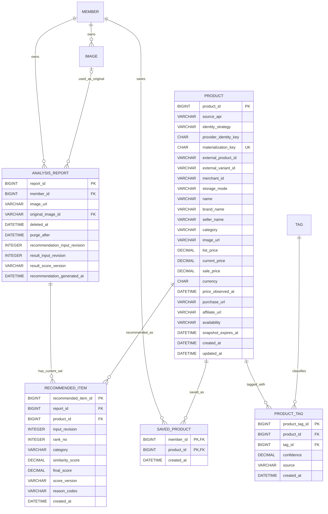

# Recommendation/Product 및 이미지 ERD 계약

## 0. 문서 정보

| 항목 | 값 |
| --- | --- |
| 기준일 | 2026-07-24 |
| 적용 범위 | 추천 결과 생성, 상품 검색·상세, 쇼핑 API 연동, 추천 상품 저장, 카테고리별 그룹핑, 기존 이미지 metadata |
| 기준 코드 | 현재 `develop`의 `Member`, `AnalysisReport`, `Tag`, `Product`, `ProductTag`, `RecommendedItem` |
| 연동 참고 | Recommendation은 기존 Analysis 결과를 읽기 전용 입력으로 사용 |
| 문서 성격 | Issue `#98` 데이터 계약. 실제 Entity·migration 변경은 후속 기능 이슈에서 진행 |

이 문서는 임시 ERD의 `products`, `recommendations`, `product_saves`,
`product_style_tags` 개념을 현재 단수형 테이블명과 JPA 모델에 맞춘다. 현재 코드와 다른 항목은
후속 Entity 및 migration 후보이며 이 문서 수정만으로 운영 DDL을 실행하지 않는다.

---

## 1. 결정 사항

### 1.1 이름과 소유권

- `users` 대신 현재 Entity의 `member(member_id)`를 사용한다.
- `analysis_requests` 대신 현재 Entity의 `analysis_report(report_id)`를 사용한다.
- `style_tags` 대신 현재 Entity의 `tag(tag_id)`를 사용한다.
- Recommendation/Product 테이블은 단수형 `product`, `product_tag`, `recommended_item`,
  `saved_product`를 사용한다.
- `SavedProduct`는 추천 결과 행이 아니라 사용자가 직접 선택한 상품 저장 관계다.
- Request에서 `member_id`를 받지 않고 인증 principal의 회원을 사용한다.
- 추천 결과의 소유권은 연결된 `AnalysisReport.member`로 판정한다.
- 원상품 후보·기준 가격 확정과 분석 태그 변경은 이번 데이터 계약에 포함하지 않는다.

### 1.2 외부 상품 identity와 snapshot

`Product`는 외부 검색 결과 전체를 자동 적재하는 카탈로그가 아니다. 상세 조회, 추천 결과 저장,
사용자 저장을 지원할 수 있도록 검증·materialize된 내부 참조만 저장한다.

| 구분 | 의미 | DB 저장 |
| --- | --- | --- |
| `PROVIDER_KEY` | 공급자가 재조회 가능한 안정 ID를 제공 | provider identity와 허용된 snapshot |
| `SNAPSHOT_UUID` | 안정 ID는 없지만 약관이 snapshot 저장을 허용 | 내부 ID와 허용된 snapshot |
| `SNAPSHOT` | 표시용 상품명·가격·이미지·URL 저장 허용 | 허용 범위와 TTL 안에서 저장 |
| `IDENTITY_ONLY` | 표시용 검색 결과 저장 불가 또는 live lookup 필수 | provider identity만 저장하고 응답 시 hydrate |

```text
providerIdentityKey = SHA-256(
  identityVersion + "|" + sourceApi + "|" + externalProductId + "|"
  + nullToEmpty(externalVariantId) + "|" + nullToEmpty(merchantId)
)
```

- `provider_identity_key`는 64자 lowercase hex이며 application service가 생성한다.
- `UNIQUE(source_api, provider_identity_key)`로 안정 identity 중복을 방지한다.
- `SNAPSHOT_UUID`는 token의 random nonce를 versioned SHA-256한 `materialization_key`로 같은
  token 재시도만 멱등 처리한다. 원문 token·nonce는 저장하지 않는다.
- 안정 ID도 없고 snapshot 저장도 허용되지 않는 후보는 Product로 만들지 않는다.

### 1.3 가격과 통화

- 금액은 `DECIMAL(19,2)`, 통화는 ISO 4217 대문자 `CHAR(3)`를 사용한다.
- Java 금액 타입은 `BigDecimal`이며 `double`과 `float`를 사용하지 않는다.
- `list_price`, `current_price`, `sale_price`의 공급자 의미를 구분한다.
- 가격이 하나라도 저장되면 `currency`와 `price_observed_at`이 있어야 한다.
- 가격은 검색·상세·저장 목록의 표시 데이터다.
- 추천 점수, 가성비 판정, 기준 가격 비교에는 사용하지 않는다.
- 공급자 정책이 가격 snapshot 저장을 금지하면 금액을 저장하지 않고 live lookup한다.

### 1.4 추천 현재 세트와 입력 version

- 리포트마다 추천 이력 없이 현재 세트 하나만 유지한다.
- 같은 리포트 재생성은 짧은 write transaction에서 기존 `recommended_item`을 교체한다.
- 외부 API 호출은 write transaction 밖에서 수행한다.
- `analysis_report.recommendation_input_revision`은 Analysis 도메인이 분석 결과나 ReportTag를
  변경할 때 증가시키며 Recommendation은 읽기만 한다.
- 추천 요청은 외부 호출 전 입력 revision을 캡처하고 저장 직전에 다시 비교한다.
- 값이 다르면 새 세트를 저장하지 않고 기존 세트를 유지한다.
- 성공 결과는 사용한 `result_input_revision`, `result_score_version`, 생성 시각을 기록한다.
- 추천 생성·교체와 `saved_product` 생명주기는 서로 독립적이다.
- 현재 세트에는 materialize 가능한 Product만 포함한다.

---

## 2. enum 저장 계약

모든 enum은 Java `@Enumerated(EnumType.STRING)`과 DB `VARCHAR`로 저장한다. ordinal은 금지한다.

| enum | DB 컬럼 | 값 |
| --- | --- | --- |
| `ProductIdentityStrategy` | `product.identity_strategy VARCHAR(30)` | `PROVIDER_KEY`, `SNAPSHOT_UUID` |
| `ProductStorageMode` | `product.storage_mode VARCHAR(20)` | `SNAPSHOT`, `IDENTITY_ONLY` |
| `ProductAvailability` | `product.availability VARCHAR(30)` | `AVAILABLE`, `UNAVAILABLE`, `TEMPORARILY_UNRESOLVED`, `UNKNOWN` |
| `ProductCategory` | category 컬럼 `VARCHAR(30)` | `OUTER`, `TOP`, `BOTTOM`, `DRESS`, `SHOES`, `BAG`, `ACCESSORY`, `OTHER` |
| `RecommendationScoreVersion` | `recommended_item.score_version VARCHAR(30)` | `SIMILARITY_V1` |
| `ProductTagSource` | `product_tag.source VARCHAR(20)` | `PROVIDER`, `AI`, `RULE`, `MANUAL` |
| `ImageUploadPurpose` | API request enum | `ANALYSIS`, `LOOKBOOK`, `PROFILE` |
| `ImagePurpose` | `image.purpose VARCHAR(30)` 호환 저장 enum | 릴리스 A writer: `ANALYSIS_ORIGINAL`, `LOOKBOOK_ORIGINAL`, `PROFILE`; reader/domain check: `ANALYSIS_ORIGINAL`, `LOOKBOOK_ORIGINAL`, `LOOKBOOK_MATCHED`, `PROFILE`, `ANALYSIS`, `LOOKBOOK` |
| `ImageStatus` | `image.status VARCHAR(20)` 호환 저장 enum | 릴리스 A writer: `PENDING`; reader/domain check: `PENDING`, `PENDING_UPLOAD`, `READY`, `ACTIVE`, `DELETING`, `DELETE_FAILED`, `DELETED`, `REJECTED` |
| `ImageVisibility` | `image.visibility VARCHAR(20)` | `PRIVATE`, `PUBLIC` |

카테고리는 위 순서로 노출하고 각 추천 그룹은 최대 5개이며 빈 그룹도 반환한다. 외부 공급자의
카테고리 원문은 내부 enum 컬럼에 직접 저장하지 않고 Adapter에서 매핑한다.

---

## 3. 논리 ERD



---

## 4. 물리 테이블 계약

### 4.1 `product`

| 컬럼 | 타입 | NULL | 키/설명 |
| --- | --- | --- | --- |
| `product_id` | `BIGINT` | N | PK, auto increment |
| `source_api` | `VARCHAR(50)` | N | 공급자 중립 내부 식별자 |
| `identity_strategy` | `VARCHAR(30)` | N | identity enum |
| `provider_identity_key` | `CHAR(64)` | Y | 안정 identity hash |
| `materialization_key` | `CHAR(64)` | Y | snapshot token 멱등 key |
| `external_product_id` | `VARCHAR(255)` | Y | 공급자 상품 ID |
| `external_variant_id` | `VARCHAR(255)` | Y | 공급자 variant ID |
| `merchant_id` | `VARCHAR(255)` | Y | 공급자 판매처 ID |
| `storage_mode` | `VARCHAR(20)` | N | snapshot 또는 identity-only |
| `name` | `VARCHAR(255)` | Y | 허용된 표시 snapshot |
| `brand_name` | `VARCHAR(255)` | Y | 허용된 표시 snapshot |
| `seller_name` | `VARCHAR(255)` | Y | 허용된 표시 snapshot |
| `category` | `VARCHAR(30)` | Y | 내부 category enum |
| `image_url` | `VARCHAR(2048)` | Y | 허용된 대표 이미지 |
| `list_price` | `DECIMAL(19,2)` | Y | 공급자 표시 정가 |
| `current_price` | `DECIMAL(19,2)` | Y | 공급자 표시 현재가 |
| `sale_price` | `DECIMAL(19,2)` | Y | 공급자 표시 할인가 |
| `currency` | `CHAR(3)` | Y | 가격 통화 |
| `price_observed_at` | `DATETIME(6)` | Y | 가격 관측 시각 |
| `purchase_url` | `VARCHAR(2048)` | Y | 구매 URL |
| `affiliate_url` | `VARCHAR(2048)` | Y | 채택된 경우 제휴 URL |
| `availability` | `VARCHAR(30)` | N | 판매·조회 상태 |
| `snapshot_expires_at` | `DATETIME(6)` | Y | snapshot TTL |
| `created_at` | `DATETIME(6)` | N | 생성 시각 |
| `updated_at` | `DATETIME(6)` | N | 수정 시각 |

```text
UK_PRODUCT_SOURCE_IDENTITY(source_api, provider_identity_key)
UK_PRODUCT_MATERIALIZATION_KEY(materialization_key)
IDX_PRODUCT_CATEGORY_AVAILABILITY(category, availability)
CHK_PRODUCT_IDENTITY_STRATEGY(
  (identity_strategy='PROVIDER_KEY' AND provider_identity_key IS NOT NULL)
  OR (identity_strategy='SNAPSHOT_UUID' AND materialization_key IS NOT NULL)
)
CHK_PRODUCT_PRICE_METADATA(
  (list_price IS NULL AND current_price IS NULL AND sale_price IS NULL
   AND currency IS NULL AND price_observed_at IS NULL)
  OR (currency IS NOT NULL AND price_observed_at IS NOT NULL)
)
CHK_PRODUCT_PRICE_VALUE(
  (list_price IS NULL OR list_price >= 0)
  AND (current_price IS NULL OR current_price >= 0)
  AND (sale_price IS NULL OR sale_price >= 0)
)
```

### 4.2 `recommended_item`

| 컬럼 | 타입 | NULL | 키/설명 |
| --- | --- | --- | --- |
| `recommended_item_id` | `BIGINT` | N | PK, auto increment |
| `report_id` | `BIGINT` | N | FK, 추천 소유 리포트 |
| `product_id` | `BIGINT` | N | FK, materialize된 Product |
| `input_revision` | `INT` | N | 생성에 사용한 분석 결과 version |
| `rank_no` | `INT` | N | category 안의 1~5 순위 |
| `category` | `VARCHAR(30)` | N | 생성 시점 내부 category |
| `similarity_score` | `DECIMAL(5,2)` | N | 0~100 정규화 점수 |
| `final_score` | `DECIMAL(5,2)` | N | 이번 범위에서는 similarity와 동일 |
| `score_version` | `VARCHAR(30)` | N | `SIMILARITY_V1` |
| `reason_codes` | `VARCHAR(500)` | N | 정렬된 내부 code 목록 |
| `created_at` | `DATETIME(6)` | N | 생성 시각 |

```text
UK_RECOMMENDED_REPORT_PRODUCT(report_id, product_id)
UK_RECOMMENDED_REPORT_CATEGORY_RANK(report_id, category, rank_no)
IDX_RECOMMENDED_REPORT_CATEGORY_SCORE(report_id, category, final_score DESC, product_id)
FK_RECOMMENDED_REPORT(report_id)
  -> analysis_report(report_id) ON DELETE CASCADE ON UPDATE RESTRICT
FK_RECOMMENDED_PRODUCT(product_id)
  -> product(product_id) ON DELETE RESTRICT ON UPDATE RESTRICT
CHK_RECOMMENDED_RANK(rank_no BETWEEN 1 AND 5)
CHK_RECOMMENDED_SCORE(
  similarity_score BETWEEN 0 AND 100
  AND final_score BETWEEN 0 AND 100
  AND final_score = similarity_score
)
CHK_RECOMMENDED_INPUT_REVISION(input_revision >= 1)
```

`reason_codes`는 공급자 자유 텍스트가 아니라 `HIGH_SIMILARITY`처럼 서버가 정의한 code만 저장한다.
다국어 문장은 API 계층이 code로 조립한다.

### 4.3 `saved_product`

| 컬럼 | 타입 | NULL | 키/설명 |
| --- | --- | --- | --- |
| `member_id` | `BIGINT` | N | PK, FK, 저장 회원 |
| `product_id` | `BIGINT` | N | PK, FK, 저장 상품 |
| `created_at` | `DATETIME(6)` | N | 저장 시각 |

```text
PK_SAVED_PRODUCT(member_id, product_id)
IDX_SAVED_PRODUCT_MEMBER_CURSOR(member_id, created_at DESC, product_id DESC)
FK_SAVED_PRODUCT_MEMBER(member_id)
  -> member(member_id) ON DELETE CASCADE ON UPDATE RESTRICT
FK_SAVED_PRODUCT_PRODUCT(product_id)
  -> product(product_id) ON DELETE RESTRICT ON UPDATE RESTRICT
```

- JPA는 `SavedProductId(memberId, productId)`의 `@EmbeddedId`와 `@MapsId`를 사용한다.
- 생성·삭제는 복합 PK를 기준으로 멱등 처리한다.
- 추천 세트 교체, 품절, 공급자 장애가 저장 관계를 삭제하지 않는다.

### 4.4 `product_tag`

| 컬럼 | 타입 | NULL | 키/설명 |
| --- | --- | --- | --- |
| `product_tag_id` | `BIGINT` | N | PK, 현재 surrogate ID 유지 |
| `product_id` | `BIGINT` | N | FK, UK 일부 |
| `tag_id` | `BIGINT` | N | FK, UK 일부 |
| `confidence` | `DECIMAL(5,4)` | Y | 0~1, 수치 근거가 있을 때만 |
| `source` | `VARCHAR(20)` | N | 태그 생성 출처 |
| `created_at` | `DATETIME(6)` | N | 생성 시각 |

```text
UK_PRODUCT_TAG_PRODUCT_ID_TAG_ID(product_id, tag_id)
IDX_PRODUCT_TAG_TAG_PRODUCT(tag_id, product_id)
FK_PRODUCT_TAG_PRODUCT(product_id)
  -> product(product_id) ON DELETE CASCADE ON UPDATE RESTRICT
FK_PRODUCT_TAG_TAG(tag_id)
  -> tag(tag_id) ON DELETE RESTRICT ON UPDATE RESTRICT
CHK_PRODUCT_TAG_CONFIDENCE(confidence IS NULL OR confidence BETWEEN 0 AND 1)
```

### 4.5 기존 `analysis_report` 확장

| 컬럼 | 타입 | NULL | 설명 |
| --- | --- | --- | --- |
| `image_url` | `VARCHAR(2048)` | Y | multipart 호환 이미지 URL. `original_image_id`와 상호 배타 |
| `original_image_id` | `VARCHAR(36)` | Y | Presigned 업로드 이미지 ID |
| `deleted_at` | `DATETIME(6)` | Y | soft delete 시각 |
| `purge_after` | `DATETIME(6)` | Y | 물리 정리 가능 시각 |
| `recommendation_input_revision` | `INT` | N | Analysis가 결과 변경 시 증가시키는 version |
| `result_input_revision` | `INT` | Y | 마지막 성공 추천이 사용한 version |
| `result_score_version` | `VARCHAR(30)` | Y | 마지막 성공 점수 정책 |
| `recommendation_generated_at` | `DATETIME(6)` | Y | 빈 세트를 포함한 마지막 성공 시각 |

```text
IDX_ANALYSIS_REPORT_PURGE_AFTER(purge_after)
FK_ANALYSIS_REPORT_IMAGE_OWNER(original_image_id, member_id)
  -> image(image_id, owner_id) ON DELETE RESTRICT
CHK_ANALYSIS_REPORT_IMAGE_SOURCE(
  (original_image_id IS NULL AND image_url IS NOT NULL)
  OR (original_image_id IS NOT NULL AND image_url IS NULL)
)
CHK_ANALYSIS_RECOMMENDATION_INPUT_REVISION(recommendation_input_revision >= 1)
CHK_ANALYSIS_RESULT_INPUT_REVISION(result_input_revision IS NULL OR result_input_revision >= 1)
CHK_ANALYSIS_RESULT_METADATA(
  (recommendation_generated_at IS NULL AND result_input_revision IS NULL
   AND result_score_version IS NULL)
  OR (recommendation_generated_at IS NOT NULL AND result_input_revision IS NOT NULL
      AND result_score_version IS NOT NULL)
)
```

Recommendation은 입력 revision을 증가시키거나 분석 태그를 바꾸지 않는다. 저장 직전에 현재
revision과 요청 snapshot을 비교하며 같을 때만 현재 추천 세트와 result metadata를 교체한다.
항목이 0개여도 metadata를 남겨 미생성과 빈 성공 결과를 구분한다.

```text
recommendation_generated_at IS NULL -> NOT_GENERATED
result_input_revision != recommendation_input_revision -> STALE
그 외 -> CURRENT
```

---

## 5. 유사도 점수 영속 근거

- 공급자 raw score를 그대로 저장하지 않고 Adapter 계약으로 0~100에 정규화한다.
- 분석 태그 fallback과 normalization은 쇼핑 API Adapter contract test로 고정한다.
- `similarity_score`는 scale 2, `RoundingMode.HALF_UP`으로 저장한다.
- `final_score = similarity_score`다.
- 정렬은 `similarity_score DESC -> source_api ASC -> external_product_id ASC ->
  candidateFingerprint ASC -> product_id ASC`다.
- 가격은 점수 또는 reason code 생성에 사용하지 않는다.

---

## 6. 삭제 및 cascade 요약

| 부모 삭제 | 자식 처리 | 근거 |
| --- | --- | --- |
| `analysis_report` 물리 삭제 | recommended item `CASCADE` | 리포트 소유 결과 |
| `member` 삭제 | saved product `CASCADE` | 회원 개인 저장 관계 |
| `product` 삭제 | product tag `CASCADE` | 상품 부속 태그 |
| `product` 삭제 | recommendation, saved product `RESTRICT` | 추천 근거와 사용자 저장 보존 |
| `tag` 삭제 | product tag `RESTRICT` | 사용 중 태그 우발 삭제 방지 |

JPA에는 대규모 `CascadeType.ALL`을 기본 적용하지 않는다. 특히 Product 삭제로 저장 상품이
자동 삭제되면 안 된다.

---

## 7. 현재 Entity 대비 migration 후보

실제 변경은 후속 기능 이슈에서 migration과 함께 수행한다.

### 7.1 `Product`

- `Integer price`를 근거 있는 `BigDecimal` 가격 필드로 전환한다.
- 공급자 identity, materialization key, storage mode, availability와 TTL을 추가한다.
- `category String`은 문자열 enum으로 전환한다.
- `purchaseUrl`과 `affiliateUrl`을 분리한다.
- 기존 가격의 통화를 근거 없이 KRW로 일괄 채우지 않는다.

### 7.2 `RecommendedItem`

- `rank`를 예약어 회피용 `rankNo`/`rank_no`로 바꾼다.
- 점수를 `BigDecimal DECIMAL(5,2)`로 전환한다.
- 입력 revision, score version, category, reason codes를 추가한다.
- 가격 비교나 원상품 연결 필드는 추가하지 않는다.

### 7.3 `ProductTag`

- 현재 surrogate PK와 `(product_id, tag_id)` unique는 유지한다.
- `confidence DECIMAL(5,4)`와 `source VARCHAR(20)`를 추가한다.

### 7.4 `AnalysisReport`

- Analysis가 소유하는 `recommendationInputRevision`과 마지막 추천 결과 metadata를 추가한다.
- Recommendation 생성은 이 version을 읽고 비교할 뿐 증가시키지 않는다.

### 7.5 신규 Entity

- `SavedProduct`와 `SavedProductId`만 현재 범위의 신규 Entity 후보다.
- 추천 실행 이력은 요구사항이 생길 때 별도 migration으로 추가한다.

---

## 8. 경계와 검증 체크리스트

### Auth / Analysis 경계

- 회원 ID는 `AuthMember` principal에서만 얻는다.
- 모든 Product/Recommendation API는 인증 필수다.
- 타인 리포트와 존재하지 않는 리포트는 모두 404로 처리한다.
- Recommendation은 기존 `analysis_report`와 `report_tag`를 읽기 전용 입력으로 사용한다.
- 추천 생성 API는 태그, 매칭값, 이미지 상태를 변경하지 않는다.
- 외부 호출 뒤 입력 version이 바뀌면 새 세트를 저장하지 않는다.

### 구현 검증

- [ ] MySQL과 H2에서 금액·점수·enum 문자열 mapping이 동일함
- [ ] provider identity hash와 materialization 멱등성이 검증됨
- [ ] 상품 검색 GET이 Product를 자동 저장하지 않음
- [ ] 추천 생성 전후 AnalysisReport와 ReportTag가 변경되지 않음
- [ ] 유사도 점수와 동점 정렬이 결정적임
- [ ] 8개 그룹 순서, 그룹별 Top 5, 빈 그룹 포함이 검증됨
- [ ] 입력 version 변경 후 늦게 끝난 요청이 현재 세트를 덮어쓰지 못함
- [ ] 추천 항목 0개 성공과 미생성이 metadata로 구분됨
- [ ] `saved_product` 복합 key로 PUT/DELETE가 멱등임
- [ ] 추천 교체·공급자 장애·품절 후에도 저장 상품이 유지됨
- [ ] 공급자 약관상 저장 불가 필드가 DB에 남지 않음
- [ ] Entity 또는 DB 변경 PR에서 이 문서와 실제 migration을 함께 갱신함

---

## 9. `image` 물리 테이블 계약

`image`는 S3 객체 자체가 아니라 소유권, 업로드 의도, 검증 및 삭제 생명주기를 관리한다.
운영 DDL은 `src/main/resources/db/migration`의 Flyway migration으로 순서대로 적용하고
JPA `ddl-auto=validate`로 Entity mapping을 검증한다.

| 컬럼 | 타입 | NULL | 제약/의미 |
| --- | --- | --- | --- |
| `image_id` | `VARCHAR(36)` | N | UUID PK, `owner_id`와 `UK_IMAGE_ID_OWNER` |
| `owner_id` | `BIGINT` | N | `member.member_id` FK |
| `object_key` | `VARCHAR(512)` | N | S3 object key, `UK_IMAGE_OBJECT_KEY`. 신규 업로드는 `images/{purpose}/{memberId}/{yyyy}/{MM}/{imageId}.{ext}` |
| `purpose` | `VARCHAR(30)` | N | DB 호환 저장값. 릴리스 A 신규 writer는 API `ANALYSIS`→`ANALYSIS_ORIGINAL`, `LOOKBOOK`→`LOOKBOOK_ORIGINAL`, `PROFILE`→`PROFILE`로 저장하고 기존 `LOOKBOOK_MATCHED`는 보존 |
| `content_type` | `VARCHAR(30)` | N | 허용된 MIME type |
| `file_size` | `BIGINT` | N | 발급 요청 크기. 완료 검증 시 S3 실제값 재검증 |
| `status` | `VARCHAR(20)` | N | DB 호환 저장값. API 논리 초기 상태는 `PENDING_UPLOAD`지만 릴리스 A 신규 writer는 rollback 호환을 위해 `PENDING` 저장 |
| `visibility` | `VARCHAR(20)` | N | 신규 발급은 `PRIVATE` |
| `presigned_expires_at` | `DATETIME(6)` | Y | 업로드 URL 만료 시각. 완료·거부·삭제 선점 시 NULL |
| `uploaded_at` | `DATETIME(6)` | Y | S3 객체 검증 완료 또는 거부 처리 시각 |
| `activated_at` | `DATETIME(6)` | Y | 도메인 연결로 `ACTIVE` 전환된 시각 |
| `delete_requested_at` | `DATETIME(6)` | Y | 삭제 요청 시각 |
| `deleted_at` | `DATETIME(6)` | Y | 객체 삭제 완료 시각 |
| `retry_count` | `INT` | N | 삭제 재시도 횟수, 기본 0 |
| `next_retry_at` | `DATETIME(6)` | Y | 다음 삭제 재시도 시각 |
| `created_at` | `DATETIME(6)` | N | 생성 시각 |

인덱스는 소유자별 상태 조회용 `IX_IMAGE_OWNER_STATUS(owner_id, status)`와 오래된 상태 작업
조회용 `IX_IMAGE_STATUS_CREATED_AT(status, created_at)`를 둔다. V4 migration은 데이터 UPDATE를 수행하지 않고 check constraint만 old/new purpose와 old/new pending 상태를 모두 허용하도록 확장한다. Member 삭제 시 이미지 행이나
S3 객체를 암묵적으로 cascade 삭제하지 않고 서비스의 명시적 정리 절차를 사용한다.
