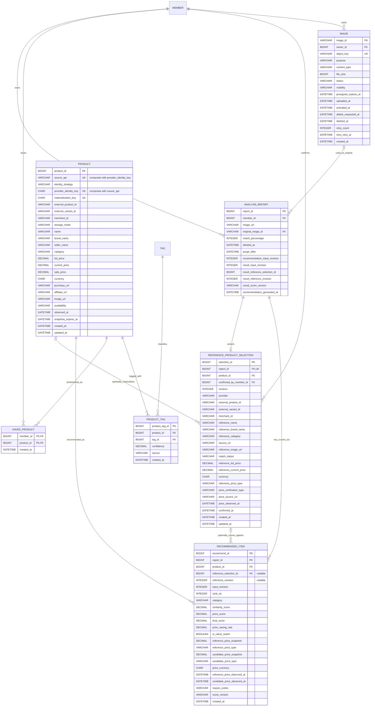

# Recommendation/Product 및 이미지 ERD 계약

## 0. 문서 정보

| 항목 | 값 |
| --- | --- |
| 기준일 | 2026-07-22 |
| 적용 범위 | Recommendation, Product, 원상품 선택, 상품 찜, 사용자 이미지 업로드 metadata |
| 기준 코드 | 현재 `develop`의 `Member`, `AnalysisReport`, `Tag`, `Product`, `ProductTag`, `RecommendedItem` |
| 연동 참고 | Auth `#20`은 PR `#34`로 병합되어 `AuthMember` principal 계약을 확인함. Analysis `#35`는 실제 연동 전 병합본 재확인 |
| 문서 성격 | Phase 0 데이터 계약. 이 문서만으로 즉시 운영 DDL을 실행하지 않음 |

이 문서는 임시 ERD의 `products`, `recommendations`, `product_saves`,
`product_style_tags` 개념을 현재 저장소의 단수형 테이블명과 JPA 모델에 맞춘다.
현재 코드와 다른 항목은 **후속 Entity 및 migration 후보**이며 Phase 0에서 DB를 직접 변경하지 않는다.

---

## 1. 결정 사항

### 1.1 이름과 소유권

- `users` 대신 현재 Entity의 `member(member_id)`를 사용한다.
- `analysis_requests` 대신 현재 Entity의 `analysis_report(report_id)`를 사용한다.
- `style_tags` 대신 현재 Entity의 `tag(tag_id)`를 사용한다.
- 테이블은 현재 규칙대로 단수형 `product`, `product_tag`, `recommended_item`,
  `reference_product_selection`, `saved_product`를 사용한다.
- `SavedProduct`는 추천 결과 저장이나 `ClosetSave`가 아니라 사용자가 직접 선택한 상품 찜이다.
- Request가 `member_id`를 받지 않으며 Auth `#20`이 제공할 인증 principal의 회원을 사용한다.
- `ReferenceProductSelection`과 `RecommendedItem`의 소유권은 연결된 `AnalysisReport.member`로 판정한다.

### 1.2 외부 상품 identity와 snapshot

`Product`는 외부 검색 결과 전체를 자동 적재하는 카탈로그가 아니다. 상세 조회 또는 찜을
지원할 수 있도록 검증·materialize된 내부 참조만 저장한다.

| 구분 | 의미 | DB 저장 |
| --- | --- | --- |
| `PROVIDER_KEY` | 공급자가 재조회 가능한 안정 ID를 제공 | provider identity와 허용된 snapshot |
| `SNAPSHOT_UUID` | 안정 ID는 없지만 약관이 명시적으로 snapshot 저장을 허용 | 내부 `product_id`와 허용된 snapshot |
| `SNAPSHOT` | 표시용 상품명·가격·이미지·URL 저장 허용 | 허용 범위와 TTL 안에서 저장 |
| `IDENTITY_ONLY` | 표시용 검색 결과 저장 불가 또는 live lookup 필수 | provider identity만 저장하고 응답 시 hydrate |

`PROVIDER_KEY` 중복 방지는 다음 규칙을 사용한다.

```text
providerIdentityKey = SHA-256(
  identityVersion + "|" + sourceApi + "|" + externalProductId + "|"
  + nullToEmpty(externalVariantId) + "|" + nullToEmpty(merchantId)
)
```

- `provider_identity_key`는 64자의 lowercase hex이며 application service에서 생성한다.
- `UNIQUE(source_api, provider_identity_key)`를 적용한다.
- MySQL 복합 UNIQUE는 NULL을 서로 다른 값으로 보므로 외부 ID nullable 컬럼을 직접 묶어
  identity 중복 방지 수단으로 사용하지 않는다.
- `SNAPSHOT_UUID`에는 `provider_identity_key=NULL`을 허용한다. 이 행은 DB가 외부 중복을
  보장하지 않으므로 명시적인 사용자 선택 또는 추천 materialization에서만 만든다.
- `SNAPSHOT_UUID` materialization은 token에 서명된 random nonce의 versioned SHA-256인
  `materialization_key`를 저장한다. 원문 token/nonce는 저장하지 않으며 같은 token 재시도만
  동일 Product로 보장한다. 새 검색 token 사이의 전역 중복은 보장하지 않는다.
- 안정 ID도 없고 snapshot 저장도 허용되지 않는 후보는 `Product`로 만들지 않으며 상세와
  찜을 지원하지 않는다.

### 1.3 가격과 통화

- 모든 금액은 `DECIMAL(19,2)`, 통화는 ISO 4217 대문자 `CHAR(3)`를 사용한다.
- Java에서는 금액에 `BigDecimal`, 통화에 검증된 3자리 문자열 또는 값 객체를 사용한다.
- `double`/`float` 및 공급자 문자열의 암묵적 환산을 사용하지 않는다.
- 정가 `list_price`, 현재가 `current_price`, 할인가 `sale_price`를 구분한다.
- `purchase_url`과 `affiliate_url`을 구분한다.
- 가격이 하나라도 저장되면 `currency`와 관측 시각이 있어야 한다.
- MVP에서는 같은 통화만 가격 비교하며 환율·배송비·관세를 계산하지 않는다.
- 기준 가격이 없거나 후보 통화가 다르면 해당 후보는 가격 필드 없이 유사도 전용으로 평가한다.
- 공급자가 가격 snapshot 저장을 금지하면 원시 금액은 저장하지 않고 허용된 파생 점수만
  `recommended_item`에 남길 수 있다.

### 1.4 추천 현재 세트와 stale

- 리포트마다 추천 이력 없이 현재 세트 하나만 유지한다.
- 같은 리포트 재생성은 한 write transaction에서 기존 `recommended_item`을 교체한다.
- 외부 API 호출은 이 write transaction에 포함하지 않는다.
- 태그 또는 `match_percentage` 확정 transaction은 `analysis_report.recommendation_input_revision`을
  1 증가시킨다. 추천 항목은 생성에 사용한 `input_revision`을 저장한다.
- 같은 transaction에서 현재 reference selection ID/revision도 요청 snapshot으로 캡처한다.
- 외부 호출 뒤 input revision 또는 reference selection ID/revision이 요청 snapshot과 다르면
  새 세트를 저장하지 않는다.
- `reference_product_selection.revision`은 원상품 또는 기준 가격이 변경될 때 1 증가한다.
- 원상품 선택은 추천 생성의 필수조건이 아니다. 선택이 없으면 추천 항목의 reference FK와
  revision을 NULL로 두고 유사도 전용 결과를 만든다.
- 원상품 선택이 있는 추천 항목은 생성 당시 `reference_revision`을 저장한다. 현재 selection
  revision과 다르거나 선택이 삭제되면 결과는 `STALE`이며 가성비 문구를 노출하지 않는다.
- `recommended_item.input_revision`이 현재 report revision과 달라도 결과는 `STALE`이다.
- 추천 재생성·삭제와 `saved_product`의 생명주기는 서로 독립적이다.
- `recommended_item.product_id`는 필수다. MVP 현재 세트는 provider identity 또는 허용
  snapshot으로 materialize 가능한 Product만 저장하며 ephemeral 추천 행은 두지 않는다.

---

## 2. enum 저장 계약

모든 enum은 Java `@Enumerated(EnumType.STRING)`과 DB `VARCHAR`로 저장한다. ordinal은 금지한다.

| enum | DB 컬럼 | 값 |
| --- | --- | --- |
| `ProductIdentityStrategy` | `product.identity_strategy VARCHAR(30)` | `PROVIDER_KEY`, `SNAPSHOT_UUID` |
| `ProductStorageMode` | `product.storage_mode VARCHAR(20)` | `SNAPSHOT`, `IDENTITY_ONLY` |
| `ProductAvailability` | `product.availability VARCHAR(30)` | `AVAILABLE`, `UNAVAILABLE`, `TEMPORARILY_UNRESOLVED`, `UNKNOWN` |
| `ProductCategory` | category 컬럼 `VARCHAR(30)` | `OUTER`, `TOP`, `BOTTOM`, `DRESS`, `SHOES`, `BAG`, `ACCESSORY`, `OTHER` |
| `ReferenceMatchStatus` | `reference_product_selection.match_status VARCHAR(20)` | `SUGGESTED`, `USER_CONFIRMED`, `REJECTED` |
| `PriceVerificationType` | `reference_product_selection.price_verification_type VARCHAR(30)` | `PROVIDER_VERIFIED`, `USER_ENTERED`, `ADMIN_VERIFIED`, `UNKNOWN` |
| `ReferencePriceType` | reference price type 컬럼 `VARCHAR(20)` | `LIST`, `CURRENT_SALE` |
| `CandidatePriceType` | candidate price type 컬럼 `VARCHAR(20)` | `CURRENT`, `SALE` |
| `RecommendationScoreVersion` | `recommended_item.score_version VARCHAR(20)` | `V1` |
| `ProductTagSource` | `product_tag.source VARCHAR(20)` | `PROVIDER`, `AI`, `RULE`, `MANUAL` |
| `ImagePurpose` | `image.purpose VARCHAR(30)` | `ANALYSIS_ORIGINAL`, `LOOKBOOK_ORIGINAL`, `LOOKBOOK_MATCHED`, `PROFILE` |
| `ImageStatus` | `image.status VARCHAR(20)` | `PENDING`, `READY`, `ACTIVE`, `DELETING`, `DELETE_FAILED`, `DELETED`, `REJECTED` |
| `ImageVisibility` | `image.visibility VARCHAR(20)` | `PRIVATE`, `PUBLIC` |

카테고리의 API 노출 순서는 enum 선언 순서와 동일하다. 각 그룹은 최대 5개이며 빈 그룹도
고정 순서로 반환한다. 외부 공급자의 카테고리 원문은 위 enum 컬럼에 직접 저장하지 않는다.
MVP는 report당 `reference_product_selection` 하나만 유지한다. 가격 점수는
`reference_category`와 추천 후보 category가 같을 때만 계산하고 다른 그룹은 similarity-only다.

원상품 탐색 후보는 기본적으로 비영속 응답이다. V1에서
`reference_product_selection` 행은 사용자가 최종 확정한 `USER_CONFIRMED` 상태만 생성한다.
`SUGGESTED`와 `REJECTED`는 API 후보 상태 호환을 위한 값이며 후보 감사 로그가 필요해질 때
별도 이슈에서 영속 범위를 확장한다.

---

## 3. 논리 ERD



---

## 4. 물리 테이블 계약

### 4.1 `product`

| 컬럼 | 타입 | NULL | 기본값 | 키 | 설명 |
| --- | --- | --- | --- | --- | --- |
| `product_id` | `BIGINT` | N | auto increment | PK | 내부 상품 ID |
| `source_api` | `VARCHAR(50)` | N | 없음 | UK 일부 | 공급자 식별자. Secret 또는 URL이 아님 |
| `identity_strategy` | `VARCHAR(30)` | N | 없음 |  | identity 전략 enum |
| `provider_identity_key` | `CHAR(64)` | Y | NULL | UK 일부 | versioned provider identity SHA-256 |
| `materialization_key` | `CHAR(64)` | Y | NULL | UK | SNAPSHOT_UUID token 재시도용 SHA-256 |
| `external_product_id` | `VARCHAR(255)` | Y | NULL | INDEX 일부 | 공급자 상품 ID |
| `external_variant_id` | `VARCHAR(255)` | Y | NULL |  | 공급자 variant ID |
| `merchant_id` | `VARCHAR(255)` | Y | NULL |  | 공급자 판매처 ID |
| `storage_mode` | `VARCHAR(20)` | N | 없음 |  | `SNAPSHOT` 또는 `IDENTITY_ONLY` |
| `name` | `VARCHAR(255)` | Y | NULL |  | 허용된 상품명 snapshot |
| `brand_name` | `VARCHAR(100)` | Y | NULL |  | 허용된 브랜드 snapshot |
| `seller_name` | `VARCHAR(100)` | Y | NULL |  | 허용된 판매처 snapshot |
| `category` | `VARCHAR(30)` | Y | NULL | INDEX 일부 | 내부 `ProductCategory` |
| `season` | `VARCHAR(20)` | Y | NULL |  | 기존 nullable snapshot 메타데이터 |
| `gender` | `VARCHAR(20)` | Y | NULL |  | 기존 nullable snapshot 메타데이터 |
| `list_price` | `DECIMAL(19,2)` | Y | NULL |  | 공급자가 명시한 정가 |
| `current_price` | `DECIMAL(19,2)` | Y | NULL |  | 현재 판매가 |
| `sale_price` | `DECIMAL(19,2)` | Y | NULL |  | 명시적 할인가 |
| `currency` | `CHAR(3)` | Y | NULL |  | 가격 통화 |
| `purchase_url` | `VARCHAR(2048)` | Y | NULL |  | canonical 구매 URL snapshot |
| `affiliate_url` | `VARCHAR(2048)` | Y | NULL |  | 제휴 이동 URL snapshot |
| `image_url` | `VARCHAR(2048)` | Y | NULL |  | 허용된 대표 이미지 URL snapshot |
| `availability` | `VARCHAR(30)` | N | `UNKNOWN` | INDEX 일부 | 판매/조회 상태 |
| `observed_at` | `DATETIME(6)` | Y | NULL |  | snapshot 관측 시각 |
| `snapshot_expires_at` | `DATETIME(6)` | Y | NULL |  | 약관상 TTL 만료 시각 |
| `created_at` | `DATETIME(6)` | N | 없음 |  | 생성 시각 |
| `updated_at` | `DATETIME(6)` | Y | NULL |  | 갱신 시각. 현재 `BaseTimeEntity`와 동일 |

제약과 인덱스:

```text
PK_PRODUCT(product_id)
UK_PRODUCT_SOURCE_IDENTITY(source_api, provider_identity_key)
UK_PRODUCT_MATERIALIZATION_KEY(materialization_key)
IDX_PRODUCT_SOURCE_EXTERNAL(source_api, external_product_id)
IDX_PRODUCT_CATEGORY_AVAILABILITY(category, availability, product_id)
CHK_PRODUCT_NONNEGATIVE_PRICE(each price IS NULL OR each price >= 0)
CHK_PRODUCT_PRICE_CURRENCY(no price OR currency IS NOT NULL)
CHK_PRODUCT_CURRENCY(currency IS NULL OR currency = UPPER(currency))
CHK_PRODUCT_PROVIDER_KEY(
  identity_strategy != 'PROVIDER_KEY'
  OR (external_product_id IS NOT NULL AND provider_identity_key IS NOT NULL)
)
CHK_PRODUCT_IDENTITY_ONLY(
  storage_mode != 'IDENTITY_ONLY'
  OR identity_strategy = 'PROVIDER_KEY'
)
CHK_PRODUCT_SNAPSHOT_UUID(
  identity_strategy != 'SNAPSHOT_UUID'
  OR (storage_mode = 'SNAPSHOT' AND provider_identity_key IS NULL
      AND materialization_key IS NOT NULL)
)
CHK_PRODUCT_MATERIALIZATION_KEY(
  materialization_key IS NULL
  OR (identity_strategy = 'SNAPSHOT_UUID' AND storage_mode = 'SNAPSHOT')
)
```

`IDENTITY_ONLY` 행에서 `name`, 가격, URL, 이미지 등 공급자가 저장을 금지한 값은 NULL이다.
`SNAPSHOT` 행은 application validation으로 `name`, `category`, `purchase_url`, `observed_at`을
필수화한다. `seller_name`과 `image_url`은 공급자가 제공하고 저장을 허용할 때만 보존한다.
`category`는 Adapter가 내부 enum으로 매핑하며 알 수 없는 구매 가능 패션 상품은 `OTHER`다.
provider별 일부 필드 저장 금지와 TTL은 Phase 2 ADR이 이 계약보다 더 엄격하게 제한할 수
있지만 임의로 완화할 수 없다.

### 4.2 `reference_product_selection`

| 컬럼 | 타입 | NULL | 기본값 | 키 | 설명 |
| --- | --- | --- | --- | --- | --- |
| `selection_id` | `BIGINT` | N | auto increment | PK | 원상품 선택 ID |
| `report_id` | `BIGINT` | N | 없음 | FK, UK | 리포트당 현재 선택 1개 |
| `product_id` | `BIGINT` | Y | NULL | FK, INDEX | materialize된 Product가 있을 때만 연결 |
| `confirmed_by_member_id` | `BIGINT` | N | 없음 | FK | 확정한 회원 |
| `revision` | `INT` | N | `1` |  | 변경 때 증가하는 optimistic evidence version |
| `provider` | `VARCHAR(50)` | N | 없음 |  | 외부 공급자 또는 `MANUAL` |
| `external_product_id` | `VARCHAR(255)` | Y | NULL |  | 후보 외부 상품 ID |
| `external_variant_id` | `VARCHAR(255)` | Y | NULL |  | 후보 variant ID |
| `merchant_id` | `VARCHAR(255)` | Y | NULL |  | 후보 판매처 ID |
| `reference_name` | `VARCHAR(255)` | N | 없음 |  | 사용자가 확인한 원상품명 |
| `reference_brand_name` | `VARCHAR(100)` | Y | NULL |  | 원상품 브랜드 |
| `reference_category` | `VARCHAR(30)` | N | 없음 |  | 원상품 내부 ProductCategory |
| `source_url` | `VARCHAR(2048)` | N | 없음 |  | 상품 근거 페이지 |
| `reference_image_url` | `VARCHAR(2048)` | Y | NULL |  | 저장 허용 시 원상품 이미지 |
| `match_status` | `VARCHAR(20)` | N | 없음 |  | V1 persisted value는 `USER_CONFIRMED` |
| `reference_list_price` | `DECIMAL(19,2)` | Y | NULL |  | 확인된 정가 |
| `reference_current_price` | `DECIMAL(19,2)` | Y | NULL |  | 확인된 현재가/사용자 입력가 |
| `currency` | `CHAR(3)` | Y | NULL |  | 기준 가격 통화 |
| `reference_price_type` | `VARCHAR(20)` | Y | NULL |  | 실제 비교 가격의 종류 |
| `price_verification_type` | `VARCHAR(30)` | N | `UNKNOWN` |  | 가격 검증 근거 |
| `price_source_url` | `VARCHAR(2048)` | Y | NULL |  | 가격 확인 URL |
| `price_observed_at` | `DATETIME(6)` | Y | NULL |  | 가격 확인 시각 |
| `confirmed_at` | `DATETIME(6)` | N | 없음 |  | 사용자 확정 시각 |
| `created_at` | `DATETIME(6)` | N | 없음 |  | 생성 시각 |
| `updated_at` | `DATETIME(6)` | Y | NULL |  | 수정 시각 |

제약, 인덱스, FK:

```text
PK_REFERENCE_PRODUCT_SELECTION(selection_id)
UK_REFERENCE_PRODUCT_SELECTION_REPORT(report_id)
UK_REFERENCE_PRODUCT_SELECTION_ID_REPORT(selection_id, report_id)
IDX_REFERENCE_PRODUCT_SELECTION_PRODUCT(product_id)
FK_REFERENCE_SELECTION_REPORT(report_id)
  -> analysis_report(report_id) ON DELETE CASCADE ON UPDATE RESTRICT
FK_REFERENCE_SELECTION_PRODUCT(product_id)
  -> product(product_id) ON DELETE SET NULL ON UPDATE RESTRICT
FK_REFERENCE_SELECTION_CONFIRMED_BY(confirmed_by_member_id)
  -> member(member_id) ON DELETE RESTRICT ON UPDATE RESTRICT
CHK_REFERENCE_REVISION(revision >= 1)
CHK_REFERENCE_POSITIVE_PRICE(each price IS NULL OR each price > 0)
CHK_REFERENCE_PRICE_EVIDENCE(
  price_verification_type = 'UNKNOWN'
  OR (reference_price_type IS NOT NULL AND currency IS NOT NULL
      AND price_observed_at IS NOT NULL)
)
CHK_REFERENCE_EXTERNAL_PRICE_SOURCE(
  price_verification_type NOT IN ('PROVIDER_VERIFIED', 'ADMIN_VERIFIED')
  OR price_source_url IS NOT NULL
)
CHK_REFERENCE_SELECTED_PRICE(
  reference_price_type IS NULL
  OR (reference_price_type = 'LIST' AND reference_list_price IS NOT NULL)
  OR (reference_price_type = 'CURRENT_SALE' AND reference_current_price IS NOT NULL)
)
```

`price_verification_type=UNKNOWN`이면 `reference_price_type`과 가격 점수는 사용하지 않는다.
사용자가 직접 입력한 가격은 `USER_ENTERED`이며 외부 검증 가격처럼 표시하지 않는다.
`USER_ENTERED`는 근거 URL 없이도 허용하지만 확인 시각과 통화는 필수다. 저장과 원상품 확인에는
사용할 수 있지만 Score V1 가격 비교에는 사용하지 않고 similarity-only로 처리한다.

### 4.3 `recommended_item`

| 컬럼 | 타입 | NULL | 기본값 | 키 | 설명 |
| --- | --- | --- | --- | --- | --- |
| `recommend_id` | `BIGINT` | N | auto increment | PK | 추천 항목 ID |
| `report_id` | `BIGINT` | N | 없음 | FK, UK 일부 | 소유 리포트 |
| `product_id` | `BIGINT` | N | 없음 | FK, UK 일부 | 추천된 내부 Product |
| `reference_selection_id` | `BIGINT` | Y | NULL | FK | 점수의 기준 원상품 선택. 없으면 similarity-only |
| `reference_revision` | `INT` | Y | NULL |  | 생성 당시 selection revision |
| `input_revision` | `INT` | N | 없음 |  | 생성에 사용한 report recommendation input revision |
| `rank_no` | `INT` | N | 없음 | UK 일부 | 카테고리 내 1~5위 |
| `category` | `VARCHAR(30)` | N | 없음 | UK 일부 | 내부 ProductCategory |
| `similarity_score` | `DECIMAL(5,2)` | N | 없음 |  | 0~100 내부 정규화 유사도 |
| `price_score` | `DECIMAL(5,2)` | Y | NULL |  | 0~100 가격 절감 점수 |
| `final_score` | `DECIMAL(5,2)` | N | 없음 | INDEX 일부 | V1 최종 점수 |
| `price_saving_rate` | `DECIMAL(26,6)` | Y | NULL |  | signed `(reference-candidate)/reference` |
| `is_value_match` | `BOOLEAN` | N | `FALSE` |  | 가성비 라벨 가능 여부 |
| `reference_price_snapshot` | `DECIMAL(19,2)` | Y | NULL |  | 정책이 허용한 생성 당시 기준 가격 |
| `reference_price_type` | `VARCHAR(20)` | Y | NULL |  | `LIST` 또는 `CURRENT_SALE` |
| `candidate_price_snapshot` | `DECIMAL(19,2)` | Y | NULL |  | 정책이 허용한 후보 유효 가격 |
| `candidate_price_type` | `VARCHAR(20)` | Y | NULL |  | `CURRENT` 또는 `SALE` |
| `price_currency` | `CHAR(3)` | Y | NULL |  | 두 가격의 동일 통화 |
| `reference_price_observed_at` | `DATETIME(6)` | Y | NULL |  | 기준 가격 확인 시각 |
| `candidate_price_observed_at` | `DATETIME(6)` | Y | NULL |  | 후보 가격 확인 시각 |
| `reason_codes` | `VARCHAR(500)` | N | 빈 문자열 |  | 정렬된 enum token의 comma 구분 값 |
| `score_version` | `VARCHAR(20)` | N | `V1` |  | 점수 정책 버전 |
| `created_at` | `DATETIME(6)` | N | 없음 |  | 생성 시각 |

제약, 인덱스, FK:

```text
PK_RECOMMENDED_ITEM(recommend_id)
UK_RECOMMENDED_ITEM_REPORT_PRODUCT(report_id, product_id)
UK_RECOMMENDED_ITEM_REPORT_CATEGORY_RANK(report_id, category, rank_no)
IDX_RECOMMENDED_ITEM_REPORT_SCORE(report_id, final_score DESC, recommend_id)
FK_RECOMMENDED_ITEM_REPORT(report_id)
  -> analysis_report(report_id) ON DELETE CASCADE ON UPDATE RESTRICT
FK_RECOMMENDED_ITEM_PRODUCT(product_id)
  -> product(product_id) ON DELETE RESTRICT ON UPDATE RESTRICT
FK_RECOMMENDED_ITEM_REFERENCE_REPORT(reference_selection_id, report_id)
  -> reference_product_selection(selection_id, report_id)
     ON DELETE RESTRICT ON UPDATE RESTRICT
CHK_RECOMMENDED_RANK(rank_no BETWEEN 1 AND 5)
CHK_RECOMMENDED_REVISION(reference_revision IS NULL OR reference_revision >= 1)
CHK_RECOMMENDED_INPUT_REVISION(input_revision >= 1)
CHK_RECOMMENDED_REFERENCE_PAIR(
  reference_selection_id IS NULL OR reference_revision IS NOT NULL
)
CHK_RECOMMENDED_SCORE(each score IS NULL OR each score BETWEEN 0 AND 100)
CHK_RECOMMENDED_PRICE_PAIR(
  (reference_price_snapshot IS NULL AND candidate_price_snapshot IS NULL)
  OR (reference_price_snapshot IS NOT NULL AND candidate_price_snapshot IS NOT NULL
      AND price_currency IS NOT NULL)
)
CHK_RECOMMENDED_PRICE_VALUE(
  reference_price_snapshot IS NULL OR reference_price_snapshot > 0
)
CHK_RECOMMENDED_CANDIDATE_PRICE(
  candidate_price_snapshot IS NULL OR candidate_price_snapshot >= 0
)
CHK_RECOMMENDED_UNVERIFIED_PRICE(
  price_score IS NOT NULL
  OR (price_saving_rate IS NULL AND is_value_match = FALSE)
)
```

`reason_codes`는 외부 자유 텍스트를 저장하지 않는다. 예: `HIGH_SIMILARITY,LOWER_PRICE`.
다국어 문장은 API 계층이 reason code로 조립한다. 별도 reason 테이블은 MVP 이후로 미룬다.

### 4.4 `saved_product`

| 컬럼 | 타입 | NULL | 기본값 | 키 | 설명 |
| --- | --- | --- | --- | --- | --- |
| `member_id` | `BIGINT` | N | 없음 | PK, FK | 찜한 회원 |
| `product_id` | `BIGINT` | N | 없음 | PK, FK | 찜한 내부 상품 |
| `created_at` | `DATETIME(6)` | N | 없음 | INDEX 일부 | 찜 생성 시각 |

제약, 인덱스, FK:

```text
PK_SAVED_PRODUCT(member_id, product_id)
IDX_SAVED_PRODUCT_MEMBER_CURSOR(member_id, created_at DESC, product_id DESC)
FK_SAVED_PRODUCT_MEMBER(member_id)
  -> member(member_id) ON DELETE CASCADE ON UPDATE RESTRICT
FK_SAVED_PRODUCT_PRODUCT(product_id)
  -> product(product_id) ON DELETE RESTRICT ON UPDATE RESTRICT
```

- 별도 surrogate ID와 `recommendation_id`를 두지 않는다.
- JPA는 `SavedProductId(memberId, productId)`의 `@EmbeddedId`와 `@MapsId`를 사용한다.
- 추천 세트가 교체되어도 PK가 추천 항목을 참조하지 않으므로 찜은 유지된다.
- 상품이 품절·not found·공급자 일시 장애여도 `Product`를 hard delete하지 않고 availability만
  변경하므로 찜 관계는 유지된다.
- 생성과 삭제는 composite PK를 기준으로 멱등 처리한다.

### 4.5 `product_tag`

| 컬럼 | 타입 | NULL | 기본값 | 키 | 설명 |
| --- | --- | --- | --- | --- | --- |
| `product_tag_id` | `BIGINT` | N | auto increment | PK | 현재 JPA의 surrogate ID 유지 |
| `product_id` | `BIGINT` | N | 없음 | FK, UK 일부 | 상품 |
| `tag_id` | `BIGINT` | N | 없음 | FK, UK 일부 | 태그 |
| `confidence` | `DECIMAL(5,4)` | Y | NULL |  | 0.0000~1.0000, 수치 근거가 있을 때만 저장 |
| `source` | `VARCHAR(20)` | N | 없음 |  | 태그 생성 출처 enum |
| `created_at` | `DATETIME(6)` | N | 없음 |  | 생성 시각 |

제약, 인덱스, FK:

```text
PK_PRODUCT_TAG(product_tag_id)
UK_PRODUCT_TAG_PRODUCT_ID_TAG_ID(product_id, tag_id)
IDX_PRODUCT_TAG_TAG_PRODUCT(tag_id, product_id)
FK_PRODUCT_TAG_PRODUCT(product_id)
  -> product(product_id) ON DELETE CASCADE ON UPDATE RESTRICT
FK_PRODUCT_TAG_TAG(tag_id)
  -> tag(tag_id) ON DELETE RESTRICT ON UPDATE RESTRICT
CHK_PRODUCT_TAG_CONFIDENCE(confidence IS NULL OR confidence BETWEEN 0 AND 1)
```

수치 근거가 없는 `MANUAL`/`RULE` 태그에 임의의 1.0을 넣지 않고 NULL을 사용한다.

### 4.6 기존 `analysis_report` 확장

| 컬럼 | 타입 | NULL | 기본값 | 키 | 설명 |
| --- | --- | --- | --- | --- | --- |
| `image_url` | `VARCHAR(2048)` | Y | NULL |  | multipart 호환 이미지 URL. `original_image_id`와 상호 배타 |
| `original_image_id` | `VARCHAR(36)` | Y | NULL | FK 일부 | Presigned 업로드 이미지 ID |
| `deleted_at` | `DATETIME(6)` | Y | NULL |  | soft delete 시각 |
| `purge_after` | `DATETIME(6)` | Y | NULL | INDEX | 물리 정리 가능 시각 |
| `recommendation_input_revision` | `INT` | N | `0` |  | 확정 태그 또는 match percentage 변경 version |
| `result_input_revision` | `INT` | Y | NULL |  | 마지막 성공 결과가 사용한 input revision |
| `result_reference_selection_id` | `BIGINT` | Y | NULL |  | 마지막 결과의 reference ID snapshot. FK 아님 |
| `result_reference_revision` | `INT` | Y | NULL |  | 마지막 결과의 reference revision snapshot |
| `result_score_version` | `VARCHAR(20)` | Y | NULL |  | 마지막 결과 점수 정책 버전 |
| `recommendation_generated_at` | `DATETIME(6)` | Y | NULL |  | 빈 세트를 포함한 마지막 성공 생성 시각 |

```text
FK_ANALYSIS_REPORT_IMAGE_OWNER(original_image_id, member_id)
  -> image(image_id, owner_id) ON DELETE RESTRICT
CHK_ANALYSIS_REPORT_IMAGE_SOURCE(
  (original_image_id IS NULL AND image_url IS NOT NULL)
  OR (original_image_id IS NOT NULL AND image_url IS NULL)
)
CHK_ANALYSIS_REPORT_MATCH(match_percentage BETWEEN 0 AND 100)
CHK_ANALYSIS_RECOMMENDATION_INPUT_REVISION(recommendation_input_revision >= 0)
CHK_ANALYSIS_RESULT_INPUT_REVISION(
  result_input_revision IS NULL OR result_input_revision >= 1
)
CHK_ANALYSIS_RESULT_REFERENCE_PAIR(
  (result_reference_selection_id IS NULL AND result_reference_revision IS NULL)
  OR (result_reference_selection_id IS NOT NULL AND result_reference_revision >= 1)
)
CHK_ANALYSIS_RESULT_METADATA(
  (recommendation_generated_at IS NULL AND result_input_revision IS NULL
   AND result_reference_selection_id IS NULL AND result_reference_revision IS NULL
   AND result_score_version IS NULL)
  OR (recommendation_generated_at IS NOT NULL AND result_input_revision IS NOT NULL
      AND result_score_version IS NOT NULL)
)
```

추천 생성의 첫 번째 짧은 transaction에서 태그와 `match_percentage`를 저장한 뒤 revision을
증가시키고 현재 reference selection ID/revision을 캡처한다. 두 번째 저장 transaction은
input revision과 reference snapshot이 모두 같을 때만 현재 추천 세트를 교체하고 result
metadata를 함께 갱신한다. 항목이 0개여도 metadata가 있어 `NOT_GENERATED`와 빈 `CURRENT`
세트를 구분한다. 외부 호출 동안 다른 PATCH나 원상품 PUT이 입력을 바꾸면 기존 세트를 유지한다.

`RecommendationStatus` 계산:

```text
recommendation_generated_at IS NULL -> NOT_GENERATED
result_input_revision != recommendation_input_revision -> STALE
result reference ID/revision != current reference ID/revision -> STALE
그 외 -> CURRENT
```

`result_reference_selection_id`는 과거 계산 근거 snapshot이므로 FK를 두지 않는다. 선택 삭제
뒤에도 값이 남아 current reference와 다름을 판정할 수 있다.

---

## 5. Score V1 영속 근거

Phase 0은 정규화된 `similarity_score` 이후의 최종 조합을 확정한다. 공급자 raw score의
normalization과 태그 fallback은 Phase 2 PoC 근거로 Phase 6에서 결정하고 contract test와
`score_version` 문서를 함께 갱신한다. raw provider score를 `similarity_score`로 직접 저장하지 않는다.

```text
referenceComparablePrice =
  priceVerificationType이 PROVIDER_VERIFIED 또는 ADMIN_VERIFIED이고
  referencePriceType=LIST이면 referenceListPrice
  referencePriceType=CURRENT_SALE이면 referenceCurrentPrice

candidateEffectivePrice =
  유효한 salePrice가 있으면 salePrice
  아니면 currentPrice

rawPriceSavingRate =
  (referenceComparablePrice - candidateEffectivePrice) / referenceComparablePrice

priceScore = clamp(rawPriceSavingRate * 100, 0, 100)
priceSavingRate = rawPriceSavingRate
finalScore = similarityScore * 0.70 + priceScore * 0.30
```

계산은 Java `BigDecimal`과 `MathContext.DECIMAL128`을 사용한다. `priceScore` 계산용
`rawPriceSavingRate * 100`만 0~100으로 clamp한다. 저장 `price_saving_rate`는 비싼 후보의
음수도 보존하는 signed ratio이며 scale 6, 각 점수는 scale 2로 `RoundingMode.HALF_UP`
반올림한다. `final_score`는 scale 2의 두 점수에 문자열 상수
`0.70`, `0.30`을 곱한 뒤 마지막에 한 번 scale 2로 반올림한다.

`is_value_match`는 아래를 모두 만족할 때만 true다.

1. `similarity_score >= 60.00`
2. 기준 가격 검증 유형이 `PROVIDER_VERIFIED` 또는 `ADMIN_VERIFIED`
3. 원상품과 후보의 내부 카테고리가 같음
4. 기준과 후보가 같은 통화임
5. `candidateEffectivePrice < referenceComparablePrice`

원상품 선택이 없거나 카테고리가 다르거나 검증 가격이 없거나 기준·후보 통화가 다르면
다음과 같이 저장한다.

```text
price_score = NULL
price_saving_rate = NULL
final_score = similarity_score
is_value_match = FALSE
```

정렬은 `final_score DESC -> similarity_score DESC -> candidateEffectivePrice ASC ->
source_api ASC -> external_product_id ASC`다. provider identity가 없는 마지막 동점은 요청 내
fingerprint 순서 뒤 `product_id ASC`로 고정한다.

가격 snapshot 저장이 금지된 경우 `reference_price_snapshot`과
`candidate_price_snapshot`은 NULL일 수 있다. 이 경우에도 공급자 약관이 파생값 저장을
허용한 경우에만 `price_score`와 `price_saving_rate`를 보존한다. Phase 2에서 허용 여부를
확인하지 못하면 가격 점수 자체를 저장하지 않고 유사도 전용 결과로 제한한다.

---

## 6. 삭제 및 cascade 요약

| 부모 삭제 | 자식 처리 | 근거 |
| --- | --- | --- |
| `analysis_report` 삭제 | selection과 recommended item `CASCADE` | 리포트 소유 데이터 |
| `reference_product_selection` 삭제 | 연결 recommended item FK `SET NULL` | 기존 결과를 stale로 표시하고 가성비 근거를 숨김 |
| `member` 삭제 | saved product `CASCADE` | 회원 개인 찜 관계 |
| `product` 삭제 | product tag `CASCADE` | 상품 부속 태그 |
| `product` 삭제 | recommendation, saved product `RESTRICT` | 추천 근거와 사용자 찜 보존. 먼저 명시적으로 정리해야 함 |
| `product` 삭제 | reference selection의 `product_id SET NULL` | 원상품 선택 snapshot은 보존 |
| `tag` 삭제 | product tag `RESTRICT` | 사용 중 태그의 우발 삭제 방지 |

JPA에는 대규모 `CascadeType.ALL`을 기본 적용하지 않는다. 위 DB 관계와 일치하는 명시적
service 삭제 또는 orphan 정책만 사용한다. 특히 `Product` 삭제로 찜이 자동 삭제되면 안 된다.

---

## 7. 현재 Entity 대비 migration 후보

Phase 0에서는 아래 변경을 문서로만 확정한다. migration 도구 도입 여부와 실제 DDL은 Entity
구현 Phase에서 별도 이슈로 처리한다.

### 7.1 `Product`

| 현재 | 목표 후보 |
| --- | --- |
| `Integer price` | `BigDecimal currentPrice` |
| `Integer averagePrice` | 제거. 원상품 기준 가격은 selection에 저장 |
| 가격 통화 없음 | `listPrice`, `salePrice`, `currency`, `observedAt` 추가 |
| `externalProductId`만 존재 | variant, merchant, identity strategy/hash 추가 |
| snapshot token 재시도 키 없음 | nullable `materializationKey` SHA-256 UK 추가 |
| snapshot 필드 대부분 NOT NULL | identity-only 행을 위해 nullable + storage mode invariant |
| `category String` | `ProductCategory` 문자열 enum |
| `purchaseUrl`만 존재 | `purchaseUrl`, `affiliateUrl` 분리 |
| 판매 상태 없음 | `ProductAvailability` 추가 |
| TTL 없음 | `snapshotExpiresAt` 추가 |
| unique identity 없음 | `UK_PRODUCT_SOURCE_IDENTITY` 추가 |

`price -> current_price` rename은 데이터 보존 migration으로 처리한다. `average_price`는 코드가
더 이상 참조하지 않는 것을 확인한 뒤 별도 drop한다. 기존 행의 통화는 근거 없이 KRW로
일괄 채우지 않는다. 확인할 수 없는 행은 가격·통화 상태를 명시적으로 보정하거나 개발 데이터로
재생성한다.

### 7.2 `RecommendedItem`

| 현재 | 목표 후보 |
| --- | --- |
| ``rank`` | 예약어 회피를 위해 `rank_no`로 rename |
| `Integer similarityScore` | `BigDecimal similarityScore DECIMAL(5,2)` |
| `valueMatch`만 존재 | price/final score, saving rate, score version 추가 |
| 추천 가격 근거 없음 | 허용된 두 가격 snapshot·통화·관측 시각 추가 |
| 기준 원상품 연결 없음 | selection FK와 revision 추가 |
| 중복/순위 UK 없음 | report-product, report-category-rank UK 추가 |

### 7.3 `ProductTag`

- 현재 surrogate PK와 `(product_id, tag_id)` unique는 유지한다.
- `confidence DECIMAL(5,4)`와 `source VARCHAR(20)`를 추가한다.
- 임시 ERD의 composite PK로 바꾸지 않아 불필요한 JPA 식별자 migration을 피한다.

### 7.4 `AnalysisReport`

- `recommendationInputRevision`을 추가하고 태그·match 확정과 함께 증가시킨다.
- 마지막 성공 세트의 input/reference revision, score version, 생성 시각 metadata를 추가한다.
- `RecommendedItem.inputRevision`과 비교해 외부 호출 중 입력 변경을 검출한다.
- 기존 행은 0으로 backfill하고 첫 추천 입력 확정부터 1 이상을 사용한다.

### 7.5 신규 Entity

- `ReferenceProductSelection`: report당 하나인 현재 원상품/가격 근거.
- `SavedProduct` + `SavedProductId`: `(member_id, product_id)` composite PK 상품 찜.
- `RecommendationRun`은 만들지 않는다. 이력이 필요할 때 별도 migration으로 추가한다.

---

## 8. Auth #20 / Analysis #35 경계 계약

### Auth `#20`

- `member_id`는 인증 principal에서만 얻는다.
- Refresh token은 별도 테이블이 아니라 `member.refresh_token VARCHAR(512) NULL`에 저장하며,
  운영 DDL은 `V3__add_member_refresh_token.sql`이 기존 컬럼 유무와 관계없이 적용한다.
- 상품 검색·상세를 포함한 모든 Recommendation/Product MVP API는 인증 필수다.
- 타인의 `AnalysisReport`와 존재하지 않는 report는 모두 404로 처리해 존재 여부를 숨긴다.
- principal의 구체 클래스는 `AuthMember`이며 member ID는
  `authMember.getMember().getId()`로 얻는다. 임시 헤더나 임의 member ID DTO를 추가하지 않는다.

### Analysis `#35`

- Recommendation은 기존 `analysis_report.report_id`와 `report_tag`를 참조한다.
- 확정 태그(`is_confirmed=true`)를 유사도 산정 입력으로 사용한다.
- `match_percentage`는 0~100의 최소 유사도 필터다. Score V1의 70:30 가중치는 바꾸지 않으며,
  `similarity_score < match_percentage`인 후보만 제외한다.
- 원상품 선택은 report에 1:1로 연결하며 별도 `analysis_requests` 테이블을 만들지 않는다.
- 추천 생성 API가 확정 태그와 매칭 정도를 갱신하더라도 외부 호출은 DB transaction 밖에서
  실행하고, 추천 현재 세트 저장만 짧은 transaction으로 처리한다.
- 외부 호출 뒤 input revision 또는 reference selection ID/revision이 달라졌으면 새 세트를
  저장하지 않는다.
- Auth `#20`은 병합된 `AuthMember` 계약을 사용한다. Analysis `#35`가 미병합인 동안에는 위
  FK/소유권 계약만 참고하고 해당 브랜치 코드를 복제하지 않는다.

---

## 9. 임시 ERD 중 이번 범위에서 보류하는 테이블

| 임시 ERD 개념 | 상태 | 사유/후속 조건 |
| --- | --- | --- |
| `shopping_malls`, `brands` | `DEFERRED` | 파트너가 불확실하므로 현재 Product의 provider/seller/brand snapshot 유지 |
| `product_images` | `DEFERRED` | MVP API는 대표 이미지 1개 사용. 다중 이미지 요구 시 추가 |
| `saved_outfits`, `saved_outfit_items` | `DEFERRED` | 상품 찜과 다른 코디 저장 도메인 |
| `lookbook_posts`, `lookbook_items` | `DEFERRED` | 기존 `lookbook` 도메인의 별도 이슈 |
| `outbound_clicks`, `purchase_events` | `DEFERRED` | 제휴/구매 attribution 확정 후 추가 |
| `recommendation_feedbacks` | `DEFERRED` | 추천 피드백 요구사항 미확정 |
| `ai_analysis_logs`, `media_files` | `DEFERRED` | Analysis/인프라 관측성 범위 |
| `user_profiles`, `closet_items`, `refresh_tokens` | `DEFERRED` | 별도 테이블은 보류하며 현재 Auth는 `member.refresh_token` 사용 |
| `analysis_request_tags`, `analysis_requests` | `NOT_ADOPTED` | 현재 `analysis_report`, `report_tag`와 중복 |
| `recommendations` | `RENAMED` | 현재 JPA의 `recommended_item`을 확장 |
| `product_saves` | `RENAMED` | 현재 단수형 규칙에 따라 `saved_product` 사용 |
| `product_style_tags` | `RENAMED` | 현재 `product_tag`를 확장 |

범위 밖 테이블을 Recommendation/Product PR에서 함께 만들지 않는다.

---

## 10. 구현 시 검증 체크리스트

- [ ] MySQL과 H2에서 `DECIMAL(19,2)`, `CHAR(3)`, enum 문자열 mapping이 동일함
- [ ] provider identity hash canonicalization 단위 테스트가 있음
- [ ] nullable 복합 UNIQUE 대신 identity hash UK가 실제 중복을 차단함
- [ ] snapshot/identity-only conditional validation이 있음
- [ ] 가격 없는 행과 서로 다른 통화가 similarity-only로 계산되고 가성비 라벨이 없음
- [ ] `reference_product_selection.revision` 변경 후 기존 추천이 stale로 판정됨
- [ ] `recommendation_input_revision` 변경 후 늦게 끝난 요청이 현재 세트를 덮어쓰지 못함
- [ ] reference selection 변경 후 늦게 끝난 요청이 현재 세트를 덮어쓰지 못함
- [ ] 추천 항목 0개인 성공 결과와 미생성 상태가 result metadata로 구분됨
- [ ] report별 product 중복과 category/rank 중복이 DB에서 차단됨
- [ ] `saved_product` composite key로 PUT/DELETE가 멱등임
- [ ] 추천 교체·공급자 장애·품절 후에도 saved product가 유지됨
- [ ] report/member 삭제 cascade와 product 삭제 restrict가 검증됨
- [ ] provider 약관상 저장 불가 필드가 DB에 남지 않음
- [ ] Entity 또는 DB 변경 PR에서 이 문서와 실제 migration을 함께 갱신함

---

## 11. `image` 물리 테이블 계약

`image`는 S3 객체 자체가 아니라 소유권, 업로드 의도, 검증 및 삭제 생명주기를 관리한다.
운영 DDL은 `src/main/resources/db/migration`의 Flyway migration으로 순서대로 적용하고
JPA `ddl-auto=validate`로 Entity mapping을 검증한다.

| 컬럼 | 타입 | NULL | 제약/의미 |
| --- | --- | --- | --- |
| `image_id` | `VARCHAR(36)` | N | UUID PK |
| `owner_id` | `BIGINT` | N | `member.member_id` FK |
| `object_key` | `VARCHAR(512)` | N | S3 object key, `UK_IMAGE_OBJECT_KEY` |
| `purpose` | `VARCHAR(30)` | N | `ImagePurpose` |
| `content_type` | `VARCHAR(30)` | N | 허용된 MIME type |
| `file_size` | `BIGINT` | N | 발급 요청 크기. 활성화 시 S3 실제값 재검증 |
| `status` | `VARCHAR(20)` | N | `ImageStatus`, 신규 발급은 `PENDING` |
| `visibility` | `VARCHAR(20)` | N | 신규 발급은 `PRIVATE` |
| `presigned_expires_at` | `DATETIME(6)` | Y | 업로드 URL 만료 시각. 완료·거부·삭제 선점 시 NULL |
| `uploaded_at` | `DATETIME(6)` | Y | S3 객체 검증 완료 또는 거부 처리 시각 |
| `activated_at` | `DATETIME(6)` | Y | 검증된 이미지가 도메인 데이터에 연결되어 `ACTIVE`가 된 시각 |
| `delete_requested_at` | `DATETIME(6)` | Y | 삭제 요청 시각 |
| `deleted_at` | `DATETIME(6)` | Y | 객체 삭제 완료 시각 |
| `retry_count` | `INT` | N | 삭제 재시도 횟수, 기본 0 |
| `next_retry_at` | `DATETIME(6)` | Y | 다음 삭제 재시도 시각 |
| `created_at` | `DATETIME(6)` | N | 생성 시각 |

인덱스는 소유자별 상태 조회용 `IX_IMAGE_OWNER_STATUS(owner_id, status)`와 오래된 상태 작업
조회용 `IX_IMAGE_STATUS_CREATED_AT(status, created_at)`를 둔다. Member 삭제 시 이미지 행이나
S3 객체를 암묵적으로 cascade 삭제하지 않고 서비스의 명시적 정리 절차를 사용한다.
