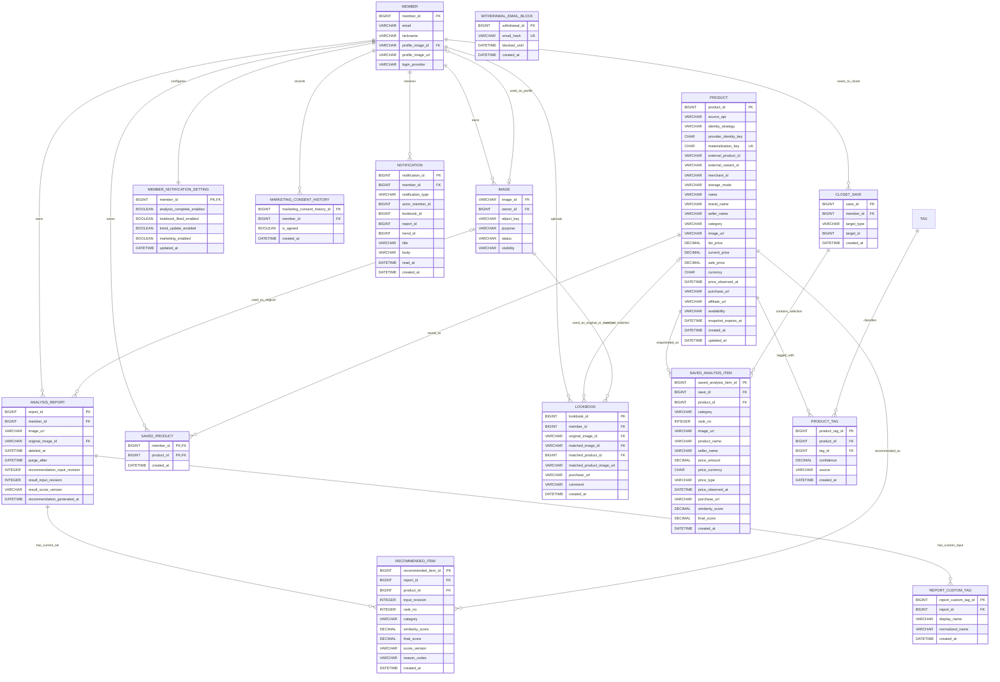

# FIT-BACK Backend ERD 및 물리 데이터 계약

## 0. 문서 정보

| 항목 | 값 |
| --- | --- |
| 기준일 | 2026-08-02 |
| 적용 범위 | 회원·프로필 이미지, 이미지 생명주기, 분석·추천·상품·저장·룩북, 알림 설정·이력·알림 목록 |
| 기준 코드 | `develop` `7a84f9c`, JPA Entity, Flyway V1~V21 |
| 연동 참고 | Recommendation은 기존 분석 입력을 읽거나 요청의 확정 태그·매칭값을 멱등 반영 |
| 문서 성격 | 현재 애플리케이션·migration이 보장하는 계약과 의도적인 scalar 참조 경계를 기록 |

이 문서는 기존 Recommendation/Product 설계에 현재 구현된 이미지, 회원 프로필,
알림 설정·동의 이력·알림 테이블을 포함한다. 운영 DDL의 단일 출처는
`src/main/resources/db/migration` 아래 V1~V21이며, 이 문서는 DDL을 대체하지 않는다.

---

## 1. 결정 사항

### 1.1 이름과 소유권

- `users` 대신 현재 Entity의 `member(member_id)`를 사용한다.
- `analysis_requests` 대신 현재 Entity의 `analysis_report(report_id)`를 사용한다.
- `style_tags` 대신 현재 Entity의 `tag(tag_id)`를 사용한다.
- Recommendation/Product 테이블은 단수형 `product`, `product_tag`, `recommended_item`,
  `saved_product`, `report_custom_tag`를 사용한다.
- `SavedProduct`는 추천 결과 행이 아니라 사용자가 직접 선택한 상품 저장 관계다.
- `ClosetSave(ANALYSIS_REPORT)`는 명시적으로 저장한 분석 리포트 관계이며,
  `SavedAnalysisItem`은 저장 시점의 카테고리별 선택 상품 표시 정보를 보존한다.
- Request에서 `member_id`를 받지 않고 인증 principal의 회원을 사용한다.
- 추천 결과의 소유권은 연결된 `AnalysisReport.member`로 판정한다.
- 원상품 후보·기준 가격 확정 모델은 이번 데이터 계약에 포함하지 않는다.

### 1.2 외부 상품 identity와 snapshot

`Product`는 외부 검색 결과 전체를 자동 적재하는 카탈로그가 아니다. 상세 조회, 추천 결과 저장,
사용자 저장을 지원할 수 있도록 검증·materialize된 내부 참조만 저장한다.

| 구분 | 의미 | DB 저장 |
| --- | --- | --- |
| `PROVIDER_KEY` | 공급자가 재조회 가능한 안정 ID를 제공 | provider identity와 허용된 snapshot |
| `SNAPSHOT_UUID` | 안정 ID는 없지만 약관이 snapshot 저장을 허용 | 내부 ID와 허용된 snapshot |
| `SNAPSHOT` | 표시용 상품명·가격·이미지·URL 저장 허용 | 허용 범위와 TTL 안에서 저장 |
| `IDENTITY_ONLY` | 표시용 검색 결과 저장 불가 또는 live lookup 필수 | provider identity만 저장하고 응답 시 hydrate |

```text
providerIdentityKey = SHA-256(
  provider + NUL + externalProductId + NUL
  + nullToEmpty(externalVariantId) + NUL + nullToEmpty(merchantId)
)
```

- `provider_identity_key`는 64자 lowercase hex이며 application service가 생성한다.
- `UNIQUE(source_api, provider_identity_key)`로 안정 identity 중복을 방지한다.
- `SNAPSHOT_UUID`/`materialization_key`는 V5에서 기존 row 백필과 schema 호환을 위해
  유지한다. 현재 검색 서비스는 안정 provider identity가 있고 lookup·저장을
  지원하는 후보에만 candidate token을 발급한다.
- 현재 materialization 경로는 unstable `SNAPSHOT_UUID` 후보를 `PRODUCT422_2`로
  거절하고 `PROVIDER_KEY`만 신규 Product로 만든다.

### 1.3 가격과 통화

- 금액은 `DECIMAL(19,2)`, 통화는 ISO 4217 대문자 `CHAR(3)`를 사용한다.
- Java 금액 타입은 `BigDecimal`이며 `double`과 `float`를 사용하지 않는다.
- `list_price`, `current_price`, `sale_price`의 공급자 의미를 구분한다.
- 가격이 하나라도 저장되면 `currency`와 `price_observed_at`이 있어야 한다.
- 가격은 검색·상세·저장 목록의 표시 데이터다.
- 추천 점수, 가성비 판정, 기준 가격 비교에는 사용하지 않는다.
- 공급자 정책이 가격 snapshot 저장을 금지하면 금액을 저장하지 않고 live lookup한다.

### 1.4 추천 현재 세트와 입력 version

- 리포트마다 추천 이력 없이 현재 세트 하나만 유지한다.
- 같은 리포트 재생성은 짧은 write transaction에서 기존 `recommended_item`을 교체한다.
- 외부 API 호출은 write transaction 밖에서 수행한다.
- `analysis_report.recommendation_input_revision`은 분석 결과 또는 추천 확정 입력의 기본 태그,
  직접 입력 태그, 매칭값이 실제로 변경될 때 증가한다.
- 같은 정규화 입력을 다시 확정하면 revision을 증가시키지 않는다.
- 추천 요청은 외부 호출 전 입력 revision, 태그 key, 매칭값을 캡처하고 저장 직전에 다시 비교한다.
- 값이 다르면 새 세트를 저장하지 않고 기존 세트를 유지한다.
- 성공 결과는 사용한 `result_input_revision`, `result_score_version`, 생성 시각을 기록한다.
- 추천 생성·교체와 `saved_product` 생명주기는 서로 독립적이다.
- 현재 세트에는 materialize 가능한 Product만 포함한다.

---

## 2. enum 저장 계약

모든 enum은 Java `@Enumerated(EnumType.STRING)`과 DB `VARCHAR`로 저장한다. ordinal은 금지한다.

| enum | DB 컬럼 | 값 |
| --- | --- | --- |
| `ProviderIdentityType` | `product.identity_strategy VARCHAR(30)` | `PROVIDER_KEY`, `SNAPSHOT_UUID` |
| `ProductStorageMode` | `product.storage_mode VARCHAR(20)` | `SNAPSHOT`, `IDENTITY_ONLY` |
| `ProductAvailability` | `product.availability VARCHAR(30)` | `AVAILABLE`, `UNAVAILABLE`, `TEMPORARILY_UNRESOLVED`, `UNKNOWN` |
| `ProductCategory` | category 컬럼 `VARCHAR(30)` | `OUTER`, `TOP`, `BOTTOM`, `DRESS`, `SHOES`, `BAG`, `ACCESSORY`, `OTHER` |
| `RecommendationScoreVersion` | `recommended_item.score_version VARCHAR(30)` | `SIMILARITY_V1`, `SIMILARITY_THRESHOLD_V2` |
| `ProductTagSource` | `product_tag.source VARCHAR(20)` | `PROVIDER`, `AI`, `RULE`, `MANUAL` |
| `ImageUploadPurpose` | API request enum | `ANALYSIS`, `LOOKBOOK`, `PROFILE` |
| `ImagePurpose` | `image.purpose VARCHAR(30)` | `ANALYSIS`, `LOOKBOOK`, `PROFILE` |
| `ImageStatus` | `image.status VARCHAR(20)` | `PENDING_UPLOAD`, `READY`, `ACTIVE`, `DELETING`, `DELETE_FAILED`, `DELETED`, `REJECTED` |
| `ImageVisibility` | `image.visibility VARCHAR(20)` | `PRIVATE`, `PUBLIC` |
| `NotificationType` | `notification.notification_type VARCHAR(30)` | `ANALYSIS_COMPLETE`, `LOOKBOOK_LIKED`, `TREND_UPDATE`, `MARKETING` |
| `NotificationTargetType` | API 응답 파생 enum, DB 미저장 | `ANALYSIS_REPORT`, `LOOKBOOK`, `TREND` |

`NotificationTargetType`은 `notification_type`과 각 scalar 대상 ID에서 응답 시 파생한다.
`notification` 테이블에 `target_type` 컬럼은 없다.

카테고리는 위 순서로 노출하고 각 추천 그룹은 최대 10개이며 빈 그룹도 반환한다. 외부 공급자의
카테고리 원문은 내부 enum 컬럼에 직접 저장하지 않고 Adapter에서 매핑한다.

---

## 3. 논리 ERD


```mermaid
erDiagram
    MEMBER ||--o{ ANALYSIS_REPORT : owns
    MEMBER ||--o{ SAVED_PRODUCT : saves
    MEMBER ||--o{ CLOSET_SAVE : saves_to_closet
    MEMBER ||--o{ LOOKBOOK : uploads
    MEMBER ||--o{ IMAGE : owns
    IMAGE o|--o| MEMBER : used_as_profile
    MEMBER ||--|| MEMBER_NOTIFICATION_SETTING : configures
    MEMBER ||--o{ MARKETING_CONSENT_HISTORY : records
    MEMBER ||--o{ NOTIFICATION : receives
    ANALYSIS_REPORT ||--o{ RECOMMENDED_ITEM : has_current_set
    ANALYSIS_REPORT ||--o{ REPORT_CUSTOM_TAG : has_custom_input
    IMAGE o|--o{ ANALYSIS_REPORT : used_as_original
    PRODUCT ||--o{ RECOMMENDED_ITEM : recommended_as
    PRODUCT ||--o{ SAVED_PRODUCT : saved_as
    PRODUCT ||--o{ SAVED_ANALYSIS_ITEM : snapshotted_as
    PRODUCT o|--o{ LOOKBOOK : used_as_matched
    CLOSET_SAVE ||--o{ SAVED_ANALYSIS_ITEM : contains_selection
    IMAGE ||--o{ LOOKBOOK : used_as_original_or_matched
    PRODUCT ||--o{ PRODUCT_TAG : tagged_with
    TAG ||--o{ PRODUCT_TAG : classifies

    MEMBER {
        BIGINT member_id PK
        VARCHAR email
        VARCHAR nickname
        VARCHAR profile_image_id FK
        VARCHAR profile_image_url
        VARCHAR login_provider
    }

    MEMBER_NOTIFICATION_SETTING {
        BIGINT member_id PK,FK
        BOOLEAN analysis_complete_enabled
        BOOLEAN lookbook_liked_enabled
        BOOLEAN trend_update_enabled
        BOOLEAN marketing_enabled
        DATETIME updated_at
    }

    MARKETING_CONSENT_HISTORY {
        BIGINT marketing_consent_history_id PK
        BIGINT member_id FK
        BOOLEAN is_agreed
        DATETIME created_at
    }

    NOTIFICATION {
        BIGINT notification_id PK
        BIGINT member_id FK
        VARCHAR notification_type
        BIGINT actor_member_id
        BIGINT lookbook_id
        BIGINT report_id
        BIGINT trend_id
        VARCHAR title
        VARCHAR body
        DATETIME read_at
        DATETIME created_at
    }

    WITHDRAWAL_EMAIL_BLOCK {
        BIGINT withdrawal_id PK
        VARCHAR email_hash UK
        DATETIME blocked_until
        DATETIME created_at
    }

    IMAGE {
        VARCHAR image_id PK
        BIGINT owner_id FK
        VARCHAR object_key
        VARCHAR purpose
        VARCHAR status
        VARCHAR visibility
    }

    ANALYSIS_REPORT {
        BIGINT report_id PK
        BIGINT member_id FK
        VARCHAR image_url
        VARCHAR original_image_id FK
        DATETIME deleted_at
        DATETIME purge_after
        INTEGER recommendation_input_revision
        INTEGER result_input_revision
        VARCHAR result_score_version
        DATETIME recommendation_generated_at
    }

    PRODUCT {
        BIGINT product_id PK
        VARCHAR source_api
        VARCHAR identity_strategy
        CHAR provider_identity_key
        CHAR materialization_key UK
        VARCHAR external_product_id
        VARCHAR external_variant_id
        VARCHAR merchant_id
        VARCHAR storage_mode
        VARCHAR name
        VARCHAR brand_name
        VARCHAR seller_name
        VARCHAR category
        VARCHAR image_url
        DECIMAL list_price
        DECIMAL current_price
        DECIMAL sale_price
        CHAR currency
        DATETIME price_observed_at
        VARCHAR purchase_url
        VARCHAR affiliate_url
        VARCHAR availability
        DATETIME snapshot_expires_at
        DATETIME created_at
        DATETIME updated_at
    }

    %% composite unique: PRODUCT(source_api, provider_identity_key)

    RECOMMENDED_ITEM {
        BIGINT recommended_item_id PK
        BIGINT report_id FK
        BIGINT product_id FK
        INTEGER input_revision
        INTEGER rank_no
        VARCHAR category
        DECIMAL similarity_score
        DECIMAL final_score
        VARCHAR score_version
        VARCHAR reason_codes
        DATETIME created_at
    }

    REPORT_CUSTOM_TAG {
        BIGINT report_custom_tag_id PK
        BIGINT report_id FK
        VARCHAR display_name
        VARCHAR normalized_name
        DATETIME created_at
    }

    SAVED_PRODUCT {
        BIGINT member_id PK,FK
        BIGINT product_id PK,FK
        DATETIME created_at
    }

    CLOSET_SAVE {
        BIGINT save_id PK
        BIGINT member_id FK
        VARCHAR target_type
        BIGINT target_id
        DATETIME created_at
    }

    SAVED_ANALYSIS_ITEM {
        BIGINT saved_analysis_item_id PK
        BIGINT save_id FK
        BIGINT product_id FK
        VARCHAR category
        INTEGER rank_no
        VARCHAR image_url
        VARCHAR product_name
        VARCHAR seller_name
        DECIMAL price_amount
        CHAR price_currency
        VARCHAR price_type
        DATETIME price_observed_at
        VARCHAR purchase_url
        DECIMAL similarity_score
        DECIMAL final_score
        DATETIME created_at
    }

    LOOKBOOK {
        BIGINT lookbook_id PK
        BIGINT member_id FK
        VARCHAR original_image_id FK
        VARCHAR matched_image_id FK
        BIGINT matched_product_id FK
        VARCHAR matched_product_image_url
        VARCHAR purchase_url
        VARCHAR comment
        DATETIME created_at
    }

    PRODUCT_TAG {
        BIGINT product_tag_id PK
        BIGINT product_id FK
        BIGINT tag_id FK
        DECIMAL confidence
        VARCHAR source
        DATETIME created_at
    }
```

---

## 4. 물리 테이블 계약

### 4.1 `product`

| 컬럼 | 타입 | NULL | 키/설명 |
| --- | --- | --- | --- |
| `product_id` | `BIGINT` | N | PK, auto increment |
| `source_api` | `VARCHAR(50)` | N | 공급자 중립 내부 식별자 |
| `identity_strategy` | `VARCHAR(30)` | N | identity enum |
| `provider_identity_key` | `CHAR(64)` | Y | 안정 identity hash |
| `materialization_key` | `CHAR(64)` | Y | snapshot token 멱등 key |
| `external_product_id` | `VARCHAR(255)` | Y | 공급자 상품 ID |
| `external_variant_id` | `VARCHAR(255)` | Y | 공급자 variant ID |
| `merchant_id` | `VARCHAR(255)` | Y | 공급자 판매처 ID |
| `storage_mode` | `VARCHAR(20)` | N | snapshot 또는 identity-only |
| `name` | `VARCHAR(255)` | Y | 허용된 표시 snapshot |
| `brand_name` | `VARCHAR(255)` | Y | 허용된 표시 snapshot |
| `seller_name` | `VARCHAR(255)` | Y | 허용된 표시 snapshot |
| `category` | `VARCHAR(30)` | Y | 내부 category enum |
| `image_url` | `VARCHAR(2048)` | Y | 허용된 대표 이미지 |
| `list_price` | `DECIMAL(19,2)` | Y | 공급자 표시 정가 |
| `current_price` | `DECIMAL(19,2)` | Y | 공급자 표시 현재가 |
| `sale_price` | `DECIMAL(19,2)` | Y | 공급자 표시 할인가 |
| `currency` | `CHAR(3)` | Y | 가격 통화 |
| `price_observed_at` | `DATETIME(6)` | Y | 가격 관측 시각 |
| `purchase_url` | `VARCHAR(2048)` | Y | 구매 URL |
| `affiliate_url` | `VARCHAR(2048)` | Y | 채택된 경우 제휴 URL |
| `availability` | `VARCHAR(30)` | N | 판매·조회 상태 |
| `snapshot_expires_at` | `DATETIME(6)` | Y | snapshot TTL |
| `created_at` | `DATETIME(6)` | N | 생성 시각 |
| `updated_at` | `DATETIME(6)` | N | 수정 시각 |

```text
UK_PRODUCT_SOURCE_IDENTITY(source_api, provider_identity_key)
UK_PRODUCT_MATERIALIZATION_KEY(materialization_key)
IDX_PRODUCT_CATEGORY_AVAILABILITY(category, availability)
CK_PRODUCT_IDENTITY_STRATEGY(
  (identity_strategy='PROVIDER_KEY' AND provider_identity_key IS NOT NULL
   AND external_product_id IS NOT NULL)
  OR (identity_strategy='SNAPSHOT_UUID' AND materialization_key IS NOT NULL)
)
CK_PRODUCT_PRICE_METADATA(
  (list_price IS NULL AND current_price IS NULL AND sale_price IS NULL
   AND currency IS NULL AND price_observed_at IS NULL)
  OR (currency IS NOT NULL AND price_observed_at IS NOT NULL
      AND (list_price IS NOT NULL OR current_price IS NOT NULL OR sale_price IS NOT NULL))
)
CK_PRODUCT_PRICE_VALUE(
  (list_price IS NULL OR list_price >= 0)
  AND (current_price IS NULL OR current_price >= 0)
  AND (sale_price IS NULL OR sale_price >= 0)
)
```

### 4.2 `recommended_item`

| 컬럼 | 타입 | NULL | 키/설명 |
| --- | --- | --- | --- |
| `recommended_item_id` | `BIGINT` | N | PK, auto increment |
| `report_id` | `BIGINT` | N | FK, 추천 소유 리포트 |
| `product_id` | `BIGINT` | N | FK, materialize된 Product |
| `input_revision` | `INT` | N | 생성에 사용한 분석 결과 version |
| `rank_no` | `INT` | N | category 안의 1~10 순위 |
| `category` | `VARCHAR(30)` | N | 생성 시점 내부 category |
| `similarity_score` | `DECIMAL(5,2)` | N | 0~100 정규화 점수 |
| `final_score` | `DECIMAL(5,2)` | N | 이번 범위에서는 similarity와 동일 |
| `score_version` | `VARCHAR(30)` | N | `SIMILARITY_V1` 또는 `SIMILARITY_THRESHOLD_V2` |
| `reason_codes` | `VARCHAR(500)` | N | 정렬된 내부 code 목록 |
| `created_at` | `DATETIME(6)` | N | 생성 시각 |

```text
UK_RECOMMENDED_REPORT_PRODUCT(report_id, product_id)
UK_RECOMMENDED_REPORT_CATEGORY_RANK(report_id, category, rank_no)
IDX_RECOMMENDED_REPORT_CATEGORY_SCORE(report_id, category, final_score DESC, product_id)
FK_RECOMMENDED_REPORT(report_id)
  -> analysis_report(report_id) ON DELETE CASCADE ON UPDATE RESTRICT
FK_RECOMMENDED_PRODUCT(product_id)
  -> product(product_id) ON DELETE RESTRICT ON UPDATE RESTRICT
CHK_RECOMMENDED_RANK(rank_no BETWEEN 1 AND 10)
CHK_RECOMMENDED_SCORE(
  similarity_score BETWEEN 0 AND 100
  AND final_score BETWEEN 0 AND 100
  AND final_score = similarity_score
)
CHK_RECOMMENDED_INPUT_REVISION(input_revision >= 1)
```

`reason_codes`는 공급자 자유 텍스트가 아니라 `HIGH_SIMILARITY`처럼 서버가 정의한 code만 저장한다.
다국어 문장은 API 계층이 code로 조립한다.

### 4.3 `report_custom_tag`

| 컬럼 | 타입 | NULL | 키/설명 |
| --- | --- | --- | --- |
| `report_custom_tag_id` | `BIGINT` | N | PK, auto increment |
| `report_id` | `BIGINT` | N | FK, 직접 입력 태그 소유 리포트 |
| `display_name` | `VARCHAR(50)` | N | NFKC 정규화 후 화면 표시명 |
| `normalized_name` | `VARCHAR(50)` | N | 소문자 정규화 중복 판정 key |
| `created_at` | `DATETIME(6)` | N | 생성 시각 |

```text
UK_REPORT_CUSTOM_TAG_NAME(report_id, normalized_name)
FK_REPORT_CUSTOM_TAG_REPORT(report_id)
  -> analysis_report(report_id) ON DELETE CASCADE ON UPDATE RESTRICT
CK_REPORT_CUSTOM_TAG_NAME(CHAR_LENGTH(TRIM(display_name)) BETWEEN 1 AND 50)
```

직접 입력 태그는 전역 `tag` 사전에 자동 등록하지 않고 리포트 입력으로만 보존한다.

### 4.4 `saved_product`

| 컬럼 | 타입 | NULL | 키/설명 |
| --- | --- | --- | --- |
| `member_id` | `BIGINT` | N | PK, FK, 저장 회원 |
| `product_id` | `BIGINT` | N | PK, FK, 저장 상품 |
| `created_at` | `DATETIME(6)` | N | 저장 시각 |

```text
PK_SAVED_PRODUCT(member_id, product_id)
IDX_SAVED_PRODUCT_MEMBER_CURSOR(member_id, created_at DESC, product_id DESC)
FK_SAVED_PRODUCT_MEMBER(member_id)
  -> member(member_id) ON DELETE CASCADE ON UPDATE RESTRICT
FK_SAVED_PRODUCT_PRODUCT(product_id)
  -> product(product_id) ON DELETE RESTRICT ON UPDATE RESTRICT
```

- JPA는 `SavedProductId(memberId, productId)`의 `@EmbeddedId`와 `@MapsId`를 사용한다.
- 생성·삭제는 복합 PK를 기준으로 멱등 처리한다.
- 추천 세트 교체, 품절, 공급자 장애가 저장 관계를 삭제하지 않는다.

### 4.5 `product_tag`

| 컬럼 | 타입 | NULL | 키/설명 |
| --- | --- | --- | --- |
| `product_tag_id` | `BIGINT` | N | PK, 현재 surrogate ID 유지 |
| `product_id` | `BIGINT` | N | FK, UK 일부 |
| `tag_id` | `BIGINT` | N | FK, UK 일부 |
| `confidence` | `DECIMAL(5,4)` | Y | 0~1, 수치 근거가 있을 때만 |
| `source` | `VARCHAR(20)` | N | 태그 생성 출처 |
| `created_at` | `DATETIME(6)` | N | 생성 시각 |

```text
UK_PRODUCT_TAG_PRODUCT_ID_TAG_ID(product_id, tag_id)
IDX_PRODUCT_TAG_TAG_PRODUCT(tag_id, product_id)
FK_PRODUCT_TAG_PRODUCT(product_id)
  -> product(product_id) ON DELETE CASCADE ON UPDATE RESTRICT
FK_PRODUCT_TAG_TAG(tag_id)
  -> tag(tag_id) ON DELETE RESTRICT ON UPDATE RESTRICT
CHK_PRODUCT_TAG_CONFIDENCE(confidence IS NULL OR confidence BETWEEN 0 AND 1)
```

### 4.6 `closet_save`와 `saved_analysis_item`

`closet_save`의 `ANALYSIS_REPORT` 관계는 사용자가 SCR-08에서 리포트 저장을 누른 경우에만
생성한다. `saved_analysis_item`은 추천 현재 세트가 재생성되어도 저장 화면이 바뀌지 않도록
선택한 상품의 표시 정보를 스냅샷으로 보존한다.

| 컬럼 | 타입 | NULL | 키/설명 |
| --- | --- | --- | --- |
| `saved_analysis_item_id` | `BIGINT` | N | PK, auto increment |
| `save_id` | `BIGINT` | N | FK, `ClosetSave(ANALYSIS_REPORT)` |
| `product_id` | `BIGINT` | N | FK, 선택한 내부 Product |
| `category` | `VARCHAR(30)` | N | 카테고리별 하나만 저장 |
| `rank_no` | `INT` | N | 저장 당시 추천 순위 |
| `image_url` | `VARCHAR(2048)` | Y | 저장 당시 상품 이미지 |
| `product_name` | `VARCHAR(255)` | Y | 저장 당시 상품명 |
| `seller_name` | `VARCHAR(255)` | Y | 저장 당시 판매처 |
| `price_amount` | `DECIMAL(19,2)` | Y | 저장 당시 표시 가격 |
| `price_currency` | `CHAR(3)` | Y | 가격 통화 |
| `price_type` | `VARCHAR(20)` | Y | `LIST`, `CURRENT`, `SALE` |
| `price_observed_at` | `DATETIME(6)` | Y | 가격 관측 시각 |
| `purchase_url` | `VARCHAR(2048)` | Y | 저장 당시 구매 URL |
| `similarity_score` | `DECIMAL(5,2)` | N | 저장 당시 유사도 |
| `final_score` | `DECIMAL(5,2)` | N | 저장 당시 최종 점수 |
| `created_at` | `DATETIME(6)` | N | 저장 시각 |

```text
UK_CLOSET_SAVE_MEMBER_ID_TARGET_TYPE_TARGET_ID(member_id, target_type, target_id)
UK_SAVED_ANALYSIS_ITEM_SAVE_CATEGORY(save_id, category)
FK_SAVED_ANALYSIS_ITEM_SAVE(save_id)
  -> closet_save(save_id) ON DELETE CASCADE ON UPDATE RESTRICT
FK_SAVED_ANALYSIS_ITEM_PRODUCT(product_id)
  -> product(product_id) ON DELETE RESTRICT ON UPDATE RESTRICT
```

V17 migration은 `closet_save`와 `trend_tag`의 같은 복합 키 중 가장 작은 surrogate ID를 보존하고
중복 행을 삭제한 뒤 Entity와 동일한 이름의 UNIQUE 제약을 보장한다. V13에서 이미 생성된
`closet_save` 제약은 재생성하지 않으며, 누락됐던
`UK_TREND_TAG_TREND_ID_TAG_ID(trend_id, tag_id)`를 추가한다.

### 4.7 기존 `analysis_report` 확장

| 컬럼 | 타입 | NULL | 설명 |
| --- | --- | --- | --- |
| `image_url` | `VARCHAR(2048)` | Y | multipart 호환 이미지 URL. `original_image_id`와 상호 배타 |
| `original_image_id` | `VARCHAR(36)` | Y | Presigned 업로드 이미지 ID |
| `deleted_at` | `DATETIME(6)` | Y | soft delete 시각 |
| `purge_after` | `DATETIME(6)` | Y | 물리 정리 가능 시각 |
| `recommendation_input_revision` | `INT` | N | Analysis가 결과 변경 시 증가시키는 version |
| `result_input_revision` | `INT` | Y | 마지막 성공 추천이 사용한 version |
| `result_score_version` | `VARCHAR(30)` | Y | 마지막 성공 점수 정책 |
| `recommendation_generated_at` | `DATETIME(6)` | Y | 빈 세트를 포함한 마지막 성공 시각 |

```text
IDX_ANALYSIS_REPORT_PURGE_AFTER(purge_after)
FK_ANALYSIS_REPORT_IMAGE_OWNER(original_image_id, member_id)
  -> image(image_id, owner_id) ON DELETE RESTRICT
CHK_ANALYSIS_REPORT_IMAGE_SOURCE(
  (original_image_id IS NULL AND image_url IS NOT NULL)
  OR (original_image_id IS NOT NULL AND image_url IS NULL)
)
CHK_ANALYSIS_RECOMMENDATION_INPUT_REVISION(recommendation_input_revision >= 1)
CHK_ANALYSIS_RESULT_INPUT_REVISION(result_input_revision IS NULL OR result_input_revision >= 1)
CHK_ANALYSIS_RESULT_METADATA(
  (recommendation_generated_at IS NULL AND result_input_revision IS NULL
   AND result_score_version IS NULL)
  OR (recommendation_generated_at IS NOT NULL AND result_input_revision IS NOT NULL
      AND result_score_version IS NOT NULL)
)
```

Recommendation의 body 요청은 확정 입력이 실제로 달라질 때만 입력 revision을 증가시킨다.
저장 직전에 현재 revision, 태그 key, 매칭값을 요청 snapshot과 비교하며 같을 때만 현재 추천
세트와 result metadata를 교체한다.
항목이 0개여도 metadata를 남겨 미생성과 빈 성공 결과를 구분한다.

```text
recommendation_generated_at IS NULL -> NOT_GENERATED
result_input_revision != recommendation_input_revision -> STALE
그 외 -> CURRENT
```

### 4.8 `lookbook` 분석 추천 상품 연결

SCR-09 직접 업로드 경로는 기존 `matched_image_id`를 사용하고, SCR-08 분석 결과 경로는
`matched_product_id`를 사용한다. 두 컬럼은 모두 nullable이지만 룩북 한 건에는 정확히 하나만
존재해야 한다. 게시 이후 상품 정보가 갱신되어도 사진이 바뀌지 않도록
`matched_product_image_url`에 게시 시점 이미지를 보존한다. 분석 원본 이미지는 기존
`original_image_id` 관계를 재사용한다.

```text
FK_LOOKBOOK_MATCHED_PRODUCT(matched_product_id)
  -> product(product_id) ON DELETE RESTRICT ON UPDATE RESTRICT
CK_LOOKBOOK_MATCH_SOURCE(
  (matched_image_id IS NOT NULL AND matched_product_id IS NULL)
  OR (matched_image_id IS NULL AND matched_product_id IS NOT NULL)
)
```

### 4.9 `member` 프로필 이미지 연결

V20은 `member`에 다음 컬럼과 복합 FK를 추가한다.

| 컬럼 | 타입 | NULL | 키/설명 |
| --- | --- | --- | --- |
| `profile_image_id` | `VARCHAR(36)` | Y | 현재 프로필 이미지 ID |

```text
FK_MEMBER_PROFILE_IMAGE_OWNER(profile_image_id, member_id)
  -> image(image_id, owner_id)
```

- FK는 프로필 이미지와 회원이 같은 소유자임을 DB에서도 보장한다.
- `image(image_id, owner_id)`의 `UK_IMAGE_ID_OWNER`가 복합 FK의 참조 key다.
- JPA `Member`는 관계 Entity 대신 scalar `profileImageId`를 mapping하고, 서비스가
  `Image` 소유권·`PROFILE` purpose·`READY` 상태를 검증해 연결한다.
- legacy `profile_image_url`은 rollback 호환을 위해 물리 schema에 남을 수 있지만
  현재 `Member` Entity는 읽거나 쓰지 않는다.
- 응답의 `profileImageUrl`은 저장 컬럼이 아니라 `profile_image_id`로 조회한
  `PRIVATE` 이미지의 10분 CloudFront Signed URL이다.

### 4.10 `member_notification_setting`과 `marketing_consent_history`

V7은 회원별 현재 알림 설정과 마케팅 동의 변경 이력을 분리했다.

`member_notification_setting`:

| 컬럼 | 타입 | NULL | 키/설명 |
| --- | --- | --- | --- |
| `member_id` | `BIGINT` | N | PK이자 `member.member_id` FK, 1:1 |
| `analysis_complete_enabled` | `TINYINT(1)` | N | 기본 `1` |
| `lookbook_liked_enabled` | `TINYINT(1)` | N | 기본 `1` |
| `trend_update_enabled` | `TINYINT(1)` | N | 기본 `0` |
| `marketing_enabled` | `TINYINT(1)` | N | 기본 `0` |
| `updated_at` | `DATETIME(6)` | N | 마지막 설정 변경 시각 |

```text
PK_MEMBER_NOTIFICATION_SETTING(member_id)
FK_MEMBER_NOTIFICATION_SETTING_MEMBER(member_id)
  -> member(member_id) ON DELETE CASCADE
```

`marketing_consent_history`:

| 컬럼 | 타입 | NULL | 키/설명 |
| --- | --- | --- | --- |
| `marketing_consent_history_id` | `BIGINT` | N | PK, auto increment |
| `member_id` | `BIGINT` | N | 동의·철회 회원 FK |
| `is_agreed` | `TINYINT(1)` | N | `1` 동의, `0` 철회 |
| `created_at` | `DATETIME(6)` | N | 변경 이력 생성 시각 |

```text
FK_MARKETING_CONSENT_HISTORY_MEMBER(member_id)
  -> member(member_id) ON DELETE CASCADE
IDX_MARKETING_CONSENT_HISTORY_MEMBER_ID(member_id)
```

V7은 기존 회원에 기본 설정 row를 멱등 backfill한다. 신규 회원이 생성될
때도 서비스가 기본 설정을 만들고, 설정 조회 시 row가 없으면 동일한 기본값을
생성한다. `marketing_enabled`가 실제로 변경될 때만 동의 이력을 추가한다.

### 4.11 `notification`

V21은 회원에게 표시할 알림, 읽음 시각, 화면 이동에 필요한 scalar 대상 ID를
저장한다.

| 컬럼 | 타입 | NULL | 키/설명 |
| --- | --- | --- | --- |
| `notification_id` | `BIGINT` | N | PK, auto increment |
| `member_id` | `BIGINT` | N | 알림 수신 회원 FK |
| `notification_type` | `VARCHAR(30)` | N | `NotificationType` |
| `actor_member_id` | `BIGINT` | Y | 알림을 촉발한 회원 ID scalar; 시스템 알림은 NULL |
| `lookbook_id` | `BIGINT` | Y | `LOOKBOOK_LIKED` 화면 이동용 scalar ID |
| `report_id` | `BIGINT` | Y | `ANALYSIS_COMPLETE` 화면 이동용 scalar ID |
| `trend_id` | `BIGINT` | Y | `TREND_UPDATE` 화면 이동용 scalar ID |
| `title` | `VARCHAR(100)` | N | 알림 제목 |
| `body` | `VARCHAR(500)` | N | 알림 본문 |
| `read_at` | `DATETIME(6)` | Y | 최초 읽음 시각; 미읽음은 NULL |
| `created_at` | `DATETIME(6)` | N | 생성 시각 |

```text
FK_NOTIFICATION_MEMBER(member_id)
  -> member(member_id) ON DELETE CASCADE
IDX_NOTIFICATION_MEMBER_ID_NOTIFICATION_ID(member_id, notification_id)
IDX_NOTIFICATION_MEMBER_ID_READ_AT(member_id, read_at)
```

`actor_member_id`, `lookbook_id`, `report_id`, `trend_id`는 의도적으로 JPA 관계와 DB FK가 아닌
scalar로 저장한다. 따라서 대상 삭제가 알림 row를 자동 삭제하지 않는다.
API `targetType`/`targetId`는 다음 규칙으로 파생한다.

| `notification_type` | 응답 `targetType` | 응답 `targetId` 원천 |
| --- | --- | --- |
| `ANALYSIS_COMPLETE` | `ANALYSIS_REPORT` | `report_id` |
| `LOOKBOOK_LIKED` | `LOOKBOOK` | `lookbook_id` |
| `TREND_UPDATE` | `TREND` | `trend_id` |
| `MARKETING` | `null` | `null` |

V21 기준으로 알림 목록·단건/전체 읽음·단건 삭제 API와 저장소는
구현되어 있다. 도메인 이벤트에서 `Notification` row를 자동 생성하는 producer는
현재 `develop`에 없으므로, 알림 유형별 자동 발송 완료를 의미하지 않는다.

### 4.12 `withdrawal_email_block`

V7은 탈퇴 이메일의 원문 대신 HMAC hash로 30일 재가입 차단을 관리한다.

| 컬럼 | 타입 | NULL | 키/설명 |
| --- | --- | --- | --- |
| `withdrawal_id` | `BIGINT` | N | PK, auto increment |
| `email_hash` | `VARCHAR(64)` | N | HMAC hex, unique |
| `blocked_until` | `DATETIME(6)` | N | 재가입 차단 만료 시각 |
| `created_at` | `DATETIME(6)` | N | 생성 시각 |

```text
UK_WITHDRAWAL_EMAIL_BLOCK_EMAIL_HASH(email_hash)
IDX_WITHDRAWAL_EMAIL_BLOCK_BLOCKED_UNTIL(blocked_until)
```

탈퇴한 `member` row와 FK를 연결하지 않아 회원 삭제 후에도 차단 기간을 유지한다.

---

## 5. 유사도 점수 영속 근거

- 공급자 raw score를 그대로 저장하지 않고 Adapter 계약으로 0~100에 정규화한다.
- 분석 태그 fallback과 normalization은 쇼핑 API Adapter contract test로 고정한다.
- `similarity_score`는 scale 2, `RoundingMode.HALF_UP`으로 저장한다.
- `final_score = similarity_score`다.
- 정렬은 `similarity_score DESC -> source_api ASC -> external_product_id ASC ->
  candidateFingerprint ASC -> product_id ASC`다.
- 가격은 점수 또는 reason code 생성에 사용하지 않는다.

---

## 6. 삭제 및 cascade 요약

| 부모 삭제 | 자식 처리 | 근거 |
| --- | --- | --- |
| `analysis_report` 물리 삭제 | recommended item, report custom tag `CASCADE` | 리포트 소유 결과·입력 |
| `member` 삭제 | saved product `CASCADE` | 회원 개인 저장 관계 |
| `member` 삭제 | closet save와 saved analysis item `CASCADE` | 회원 개인 리포트 저장 관계 |
| `member` 삭제 | member notification setting, marketing consent history `CASCADE` | 회원 설정·동의 이력 |
| `member` 삭제 | 수신한 notification `CASCADE` | 회원 개인 알림 |
| notification target 삭제 | notification 유지 | actor/lookbook/report/trend ID는 FK 없는 scalar |
| `closet_save` 삭제 | saved analysis item `CASCADE` | 저장 해제 시 선택 스냅샷 정리 |
| `product` 삭제 | product tag `CASCADE` | 상품 부속 태그 |
| `product` 삭제 | recommendation, saved product `RESTRICT` | 추천 근거와 사용자 저장 보존 |
| `product` 삭제 | 분석 상품 기반 lookbook `RESTRICT` | 게시된 룩북의 매칭 이미지 보존 |
| `tag` 삭제 | product tag `RESTRICT` | 사용 중 태그 우발 삭제 방지 |

JPA에는 대규모 `CascadeType.ALL`을 기본 적용하지 않는다. 특히 Product 삭제로 저장 상품이
자동 삭제되면 안 된다.

---

## 7. Entity·migration 상태

현재 운영 migration 계약은 V1~V21이며, 프로덕션에서 Flyway 적용 후
Hibernate `ddl-auto=validate`로 Entity mapping을 검증한다.

### 7.1 `Product`

- Issue #106과 V5 migration에서 공급자 identity, materialization key, storage mode,
  availability, snapshot TTL과 근거 있는 `BigDecimal` 가격 필드를 추가한다.
- 신규 Entity writer는 `category` 문자열 enum, 분리된 `purchaseUrl`/`affiliateUrl`과
  가격 통화·관측 시각을 함께 저장한다.
- 기존 `category`는 내부 enum 값으로 정규화하고 알 수 없는 값은 `OTHER`로 보존한다.
- rollback 호환을 위해 기존 `price`, `average_price`, `season`, `gender` 컬럼은 nullable
  legacy 컬럼으로 유지하지만 신규 Entity는 읽거나 쓰지 않는다.
- 기존 정수 가격은 통화를 추측할 수 없으므로 새 `current_price`로 백필하지 않는다.
- 기존 상품 row는 `SNAPSHOT_UUID`와 versioned legacy materialization key로 백필하며,
  신규 안정 identity 상품은 `PROVIDER_KEY`를 사용한다.

### 7.2 `RecommendedItem`

- Issue #111과 V6 migration에서 `recommend_id`를 `recommended_item_id`로,
  `rank`를 예약어 회피용 `rankNo`/`rank_no`로 바꾼다.
- 점수를 `BigDecimal DECIMAL(5,2)`로 전환하고 기존 점수를 `final_score`에도 백필한다.
- 기존 추천 항목이 있는 리포트는 마지막 항목 생성 시각과 `SIMILARITY_V1` metadata를
  함께 백필해 `NOT_GENERATED`로 잘못 표시되지 않도록 한다.
- 입력 revision, score version, category, reason codes와 현재 세트 unique/check/index
  제약을 추가한다.
- 가격 비교나 원상품 연결 필드는 추가하지 않는다.

### 7.3 `ProductTag`

- 현재 surrogate PK와 `(product_id, tag_id)` unique는 유지한다.
- `confidence DECIMAL(5,4)`와 `source VARCHAR(20)`를 추가한다.

### 7.4 `AnalysisReport`

- Issue #111과 V6 migration에서 Analysis가 소유하는 `recommendationInputRevision`과
  마지막 추천 결과 metadata를 추가한다.
- Issue #119와 V11 migration에서 직접 입력 태그를 리포트별로 추가하고, Recommendation body가
  기본·직접 입력 태그와 매칭값을 멱등 확정하도록 한다.

### 7.5 신규 Entity

- Issue #114에서 `SavedProduct`와 `SavedProductId`를 구현한다.
- Issue #119에서 `ReportCustomTag`를 구현한다.
- Issue #124에서 `ClosetSave(ANALYSIS_REPORT)`를 실제 API에 연결하고
  `SavedAnalysisItem`으로 카테고리별 선택 상품 스냅샷을 구현한다.
- 추천 실행 이력은 요구사항이 생길 때 별도 migration으로 추가한다.

### 7.6 프로토타입 분석 기준 태그

- V16 migration은 기존 태그를 변경하지 않고 누락된 `미니멀(DETAIL)`,
  `와이드핏(SILHOUETTE)`, `베이지톤(COLOR)`만 멱등하게 추가한다.
- 이 세 태그는 명시적 prototype 분석 모드의 결정적 end-to-end 검증 데이터다.
- 실제 AI 공급자를 연결할 때는 모델 결과를 승인된 태그 taxonomy에 매핑하고 prototype 분석기를
  비활성화한다.

### 7.7 이미지, 프로필, 알림

- V18은 legacy 이미지 purpose/status를 canonical 값으로 백필한다.
- V19는 legacy 잔여가 0건인지 확인한 후 `image.purpose`/`status` CHECK를
  canonical 값 전용으로 교체한다.
- V20은 `member.profile_image_id`와 이미지 소유자 복합 FK를 추가한다.
- V21은 수신 회원 FK와 scalar 대상 ID를 가진 `notification` 테이블을 추가한다.
- `member_notification_setting`/`marketing_consent_history`는 V7, 회원 삭제 cascade
  보정은 V8에서 관리한다.

---

## 8. 경계와 검증 체크리스트

### Auth / Analysis 경계

- 회원 ID는 `AuthMember` principal에서만 얻는다.
- 모든 Product/Recommendation API는 인증 필수다.
- 타인 리포트와 존재하지 않는 리포트는 모두 404로 처리한다.
- body 없는 Recommendation은 기존 `analysis_report`와 `report_tag`를 읽기 전용 입력으로 사용한다.
- body가 있으면 기본 태그, 직접 입력 태그, 매칭값을 하나의 입력으로 멱등 교체한다.
- 추천 생성 API는 이미지 상태를 변경하지 않는다.
- 외부 호출 뒤 입력 version이 바뀌면 새 세트를 저장하지 않는다.

### 구현 검증

- [ ] MySQL과 H2에서 금액·점수·enum 문자열 mapping이 동일함
- [ ] provider identity hash와 materialization 멱등성이 검증됨
- [ ] 상품 검색 GET이 Product를 자동 저장하지 않음
- [ ] body 없는 추천 생성 전후 AnalysisReport와 ReportTag가 변경되지 않음
- [ ] body 추천 생성의 기본·직접 태그와 매칭값 변경 및 동일 입력 멱등성이 검증됨
- [ ] 유사도 점수와 동점 정렬이 결정적임
- [ ] 8개 그룹 순서, 그룹별 Top 10, 빈 그룹 포함이 검증됨
- [ ] 입력 version 변경 후 늦게 끝난 요청이 현재 세트를 덮어쓰지 못함
- [ ] 추천 항목 0개 성공과 미생성이 metadata로 구분됨
- [x] `saved_product` 복합 key로 PUT/DELETE가 멱등임
- [x] 분석 리포트 저장 PUT/DELETE가 멱등이며 저장 목록이 명시적 저장 관계만 반환함
- [x] 저장된 선택 상품이 추천 현재 세트 교체와 독립된 스냅샷으로 유지됨
- [x] V20 프로필 이미지 복합 FK가 회원과 이미지 소유자 일치를 보장함
- [x] V21 notification migration이 MySQL 8.4에 적용됨
- [ ] V21 notification의 컬럼·FK·index를 별도 MySQL assertion으로 검증함
- [x] 마케팅 설정이 실제로 변경될 때만 동의 이력이 추가됨
- [ ] 추천 교체·공급자 장애·품절 후에도 저장 상품이 유지됨
- [ ] 공급자 약관상 저장 불가 필드가 DB에 남지 않음
- [ ] Entity 또는 DB 변경 PR에서 이 문서와 실제 migration을 함께 갱신함

---

## 9. `image` 물리 테이블 계약

`image`는 S3 객체 자체가 아니라 소유권, 업로드 의도, 검증 및 삭제 생명주기를 관리한다.
운영 DDL은 `src/main/resources/db/migration`의 Flyway migration으로 순서대로 적용하고
JPA `ddl-auto=validate`로 Entity mapping을 검증한다.

회원 프로필은 `member.profile_image_id`로 이미지를 참조한다. 이미지 소유 관계와 프로필
관계를 모두 보장하기 위해 다음 복합 FK를 사용한다.

```text
FK_MEMBER_PROFILE_IMAGE_OWNER(profile_image_id, member_id)
  -> image(image_id, owner_id)
```

`member.profile_image_url`은 legacy 배포 롤백을 위해 물리 schema에 남을 수 있지만
현재 애플리케이션 코드는 읽거나 쓰지 않는다. 기존 URL은 대응하는
`imageId`를 확인할 수 없으므로 백필하지 않았다.

| 컬럼 | 타입 | NULL | 제약/의미 |
| --- | --- | --- | --- |
| `image_id` | `VARCHAR(36)` | N | UUID PK, `owner_id`와 `UK_IMAGE_ID_OWNER` |
| `owner_id` | `BIGINT` | N | `member.member_id` FK |
| `object_key` | `VARCHAR(512)` | N | S3 object key, `UK_IMAGE_OBJECT_KEY`. 신규 업로드는 `images/{purpose}/{memberId}/{yyyy}/{MM}/{imageId}.{ext}` |
| `purpose` | `VARCHAR(30)` | N | `ANALYSIS`, `LOOKBOOK`, `PROFILE`; V19부터 legacy 값 금지 |
| `content_type` | `VARCHAR(30)` | N | 허용된 MIME type |
| `file_size` | `BIGINT` | N | 발급 요청 크기. 완료 검증 시 S3 실제값 재검증 |
| `status` | `VARCHAR(20)` | N | `PENDING_UPLOAD`, `READY`, `ACTIVE`, `DELETING`, `DELETE_FAILED`, `DELETED`, `REJECTED`; V19부터 `PENDING` 금지 |
| `visibility` | `VARCHAR(20)` | N | 신규 발급은 항상 `PRIVATE`; 룩북 생성 후도 전환 없음 |
| `presigned_expires_at` | `DATETIME(6)` | Y | 업로드 URL 만료 시각. 완료·거부·삭제 선점 시 NULL |
| `uploaded_at` | `DATETIME(6)` | Y | S3 객체 검증 완료 또는 거부 처리 시각 |
| `activated_at` | `DATETIME(6)` | Y | 도메인 연결로 `ACTIVE` 전환된 시각 |
| `delete_requested_at` | `DATETIME(6)` | Y | 삭제 요청 시각 |
| `deleted_at` | `DATETIME(6)` | Y | 객체 삭제 완료 시각 |
| `retry_count` | `INT` | N | 삭제 재시도 횟수, 기본 0 |
| `next_retry_at` | `DATETIME(6)` | Y | 다음 삭제 재시도 시각 |
| `created_at` | `DATETIME(6)` | N | 생성 시각 |

인덱스는 소유자별 상태 조회용 `IX_IMAGE_OWNER_STATUS(owner_id, status)`와 오래된 상태 작업
조회용 `IX_IMAGE_STATUS_CREATED_AT(status, created_at)`를 둔다. V4는 롤링 배포 중 old/new
purpose·status를 모두 허용했고, V18 백필 및 V19 zero gate 이후 현재 CHECK는
canonical 값만 허용한다. Member 삭제 시 이미지 행이나 S3 객체를 암묵적으로 cascade
삭제하지 않고 서비스의 명시적 정리·소유자 재배정 절차를 사용한다.
